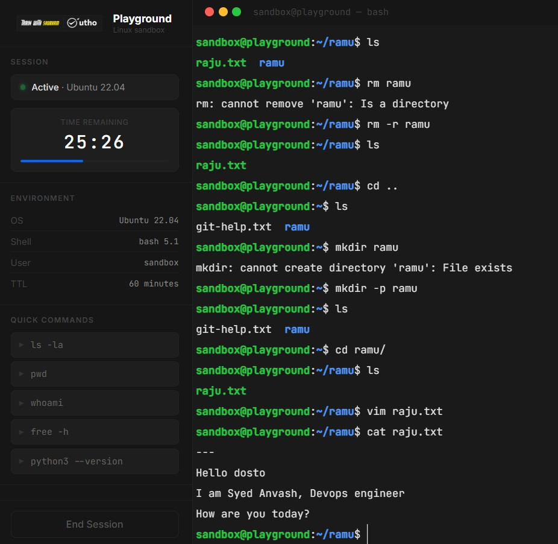

# Day 02 – Linux Architecture Notes


---

## What is Linux?

Linux is an open source operating system. Linus Torvalds started it as a personal project. Now it powers most of the servers and cloud infrastructure out there.

It has multiple versions called distros — Ubuntu, Debian, Mint, Kali etc. About 90% of servers run Linux, so as a DevOps engineer this is something I need to know well.

Unix is the paid version, mostly used in macOS.

---

## How Linux Works

Linux has 3 layers:

```
[ Applications ]  →  programs the user runs
[    Shell     ]  →  takes commands from the user (bash)
[    Kernel    ]  →  core of the OS, talks to hardware
```

- **Kernel** — written in C. Manages memory, CPU, and hardware directly.
- **Shell** — sits between the user and kernel. Reads commands and passes them on.
- **Applications** — run on top, use the shell to interact with the system.

---

## File System

Three rules to remember:

> "Everything in Linux starts from `/`"  
> "Everything in Linux is a file or folder"  
> "Everything in Linux is a process"

| Path | What it contains |
|------|-----------------|
| `/` | Root — starting point of everything |
| `/bin` | Basic commands — ls, cd, cat |
| `/etc` | Config files |
| `/home` | User files |
| `/var` | Logs and runtime data |

---

## Processes

Every running program is a process. Each gets a PID (Process ID).

When Linux boots, the first process that starts is **systemd** — it always gets **PID 1**. All other processes start from it.

### Process States

| State | Meaning |
|-------|---------|
| Running | Using the CPU right now |
| Sleeping | Waiting for input or a resource |
| Stopped | Paused with Ctrl+Z |
| Zombie | Finished but not cleared by parent process |

---

## systemd

systemd is the init system. It starts after the kernel and kicks off all services and daemons. It is always PID 1.

Commands I will use often:

```bash
systemctl status nginx        # check if nginx is running
systemctl restart nginx       # restart it
systemctl enable docker       # run docker on every boot
journalctl -u nginx           # read nginx logs
```

---

## Daily Commands

| Command | Use |
|---------|-----|
| `ls -l` | list files with details |
| `pwd` | show current directory |
| `cd <folder>` | change directory |
| `cat <file>` | read a file |
| `ps aux` | show all running processes |

Other commands used today:

```bash
df -h        # disk space
free -h      # RAM usage
uptime       # how long system has been running
date         # current date and time
history      # list of past commands
```

---

## Terminal Practice




```bash
mkdir ramu           # created a folder
cd ramu/             # moved into it
touch raju.txt       # created a file
vi raju.txt          # opened in vi editor
cat raju.txt         # read the file
head raju.txt        # first 10 lines
tail raju.txt -n 1   # last 1 line
tail raju.txt -n 2   # last 2 lines
```

Note: typed `Head` instead of `head` — got an error. Linux commands are case-sensitive.

---

## Why This Matters

Almost every production server runs Linux. Docker containers, EC2 instances, CI/CD pipelines — all Linux.

Understanding how processes and systemd work helps when a service crashes or something breaks. Instead of guessing, I can read what's happening and fix it.