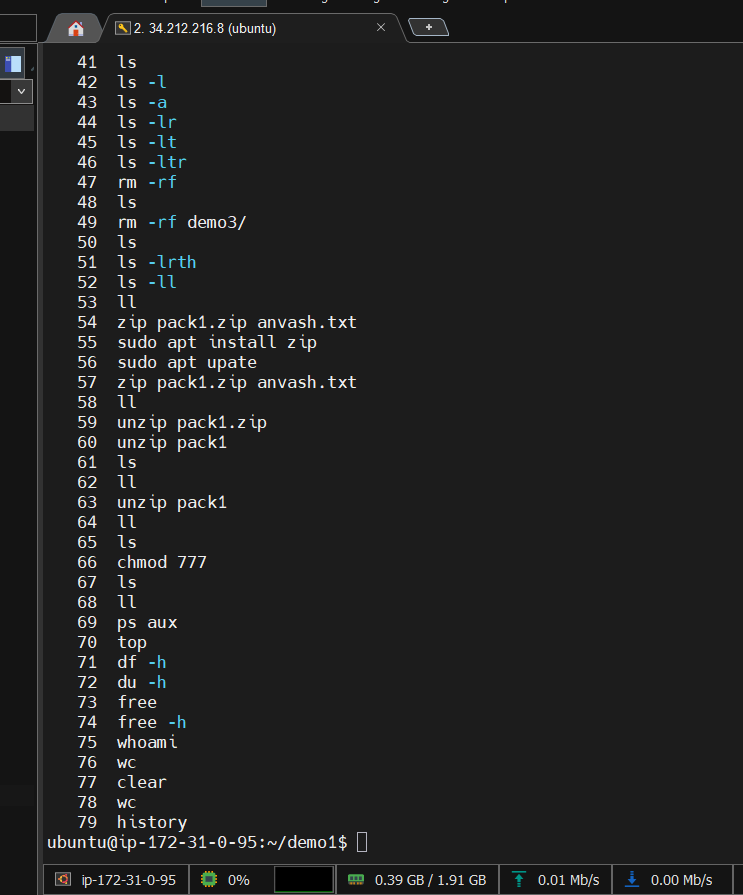
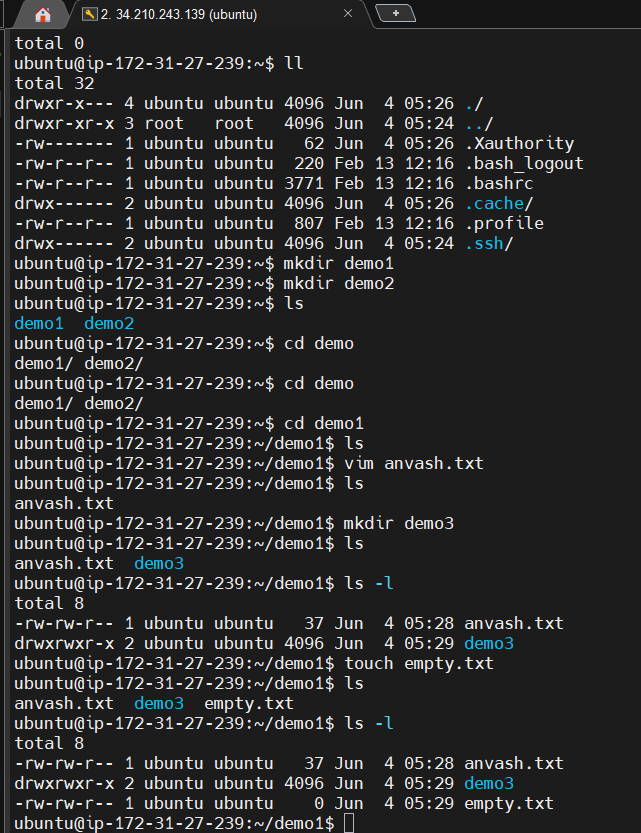
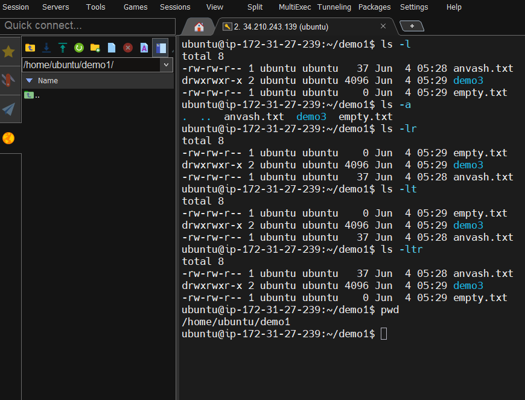
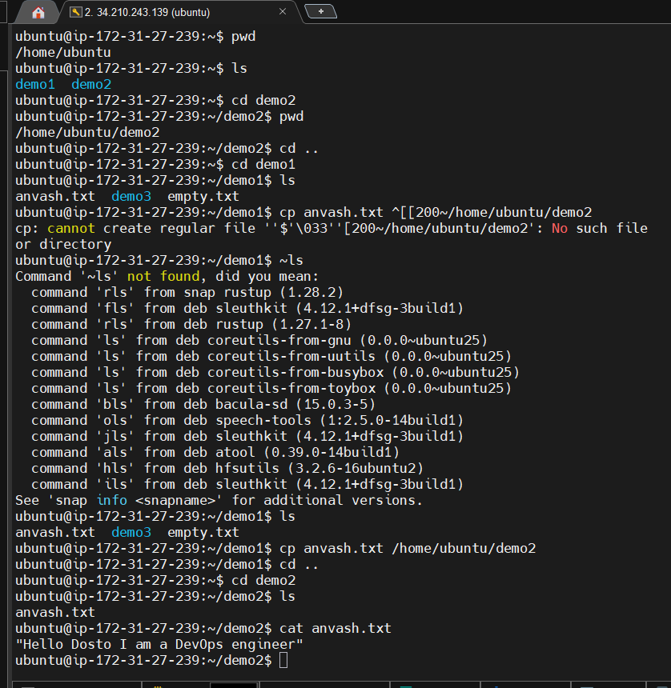
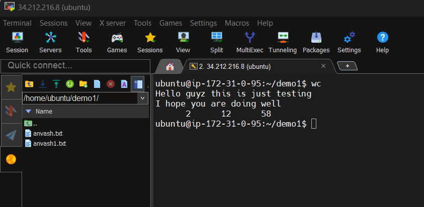

# Linux Commands Cheat Sheet
**#90DaysOfDevOps – Day 03**

---

## 📁 File & Directory Management

| Command | What It Does |
|---|---|
| `mkdir <dir>` | Create a new directory |
| `cd <dir>` | Change into a directory |
| `cd ..` | Go up one directory level |
| `ls` | List files in current directory |
| `ls -l` | Long listing (permissions, size, date) |
| `ls -a` | Show hidden files (dotfiles) |
| `ls -lr` | Long listing, reversed order |
| `ls -lt` | Long listing, sorted by newest first |
| `ls -ltr` | Long listing, sorted by oldest first |
| `pwd` | Print current working directory |
| `touch <file>` | Create an empty file |
| `cp <src> <dest>` | Copy a file to a destination |
| `rm <file>` | Remove a file |
| `rm -rf <dir>` | Force-remove a directory and all contents |
| `find` | Search for files in the directory tree |

---

## 📝 File Viewing & Editing

| Command | What It Does |
|---|---|
| `cat <file>` | Print file contents to terminal |
| `vi <file>` | Open file in vi editor |
| `vim <file>` | Open file in vim editor |

> **vim quick reference:** `i` = insert mode, `Esc` = exit insert, `:wq` = save & quit, `:q!` = quit without saving

---

## 🗜️ Compression & Archiving

| Command | What It Does |
|---|---|
| `zip <archive.zip> <file>` | Zip a file |
| `zip file.zip harshal.txt` | Example: zip a specific file |
| `unzip <archive.zip>` | Extract a zip archive |

---

## 🔐 Permissions

| Command | What It Does |
|---|---|
| `chmod 777 <file>` | Give full read/write/execute to all |
| `chmod +x <file>` | Add execute permission |
| `./script.sh` | Execute a shell script |

> **Permission digits:** 4=read, 2=write, 1=execute. So `755` = owner full, group/others read+execute.

---

## ⚙️ Process Management

| Command | What It Does |
|---|---|
| `ps aux` | Show all running processes with details |
| `top` | Live process monitor (CPU, memory usage) |

> In `top`: press `q` to quit, `k` to kill a process by PID.

---

## 💾 Disk & Memory

| Command | What It Does |
|---|---|
| `df -h` | Show disk space usage (human-readable) |
| `du -h` | Show disk usage of current directory |
| `free` | Show RAM and swap usage |
| `free -h` | Same but human-readable (MB/GB) |

---

## 👤 System Info

| Command | What It Does |
|---|---|
| `whoami` | Print current logged-in username |
| `wc` | Word/line/byte count of a file |

---

## 🌐 Networking

| Command | What It Does |
|---|---|
| `curl <url>` | Fetch a URL (test HTTP connectivity) |
| `ping <host>` | Test reachability of a host |
| `ip addr` | Show network interfaces and IP addresses |

> Example used in session: `curl https://www.trainwithshubham.com/`

---

## 🔁 Shell Utilities

| Command | What It Does |
|---|---|
| `history` | Show previously run commands |
| `clear` | Clear the terminal screen |

---

## 💡 Tips from Today's Session

- **Always `ls` after every operation** — confirm the change happened
- `ls -lt` is your friend for finding recently modified files
- `rm -rf` has no undo — double-check before running
- Shell scripts need execute permission before you can run them (`chmod +x`)
- `free` and `df -h` are your first stop when a server feels slow

---

*Built during live practice on TrainWithShubham Playground – Ubuntu 22.04*