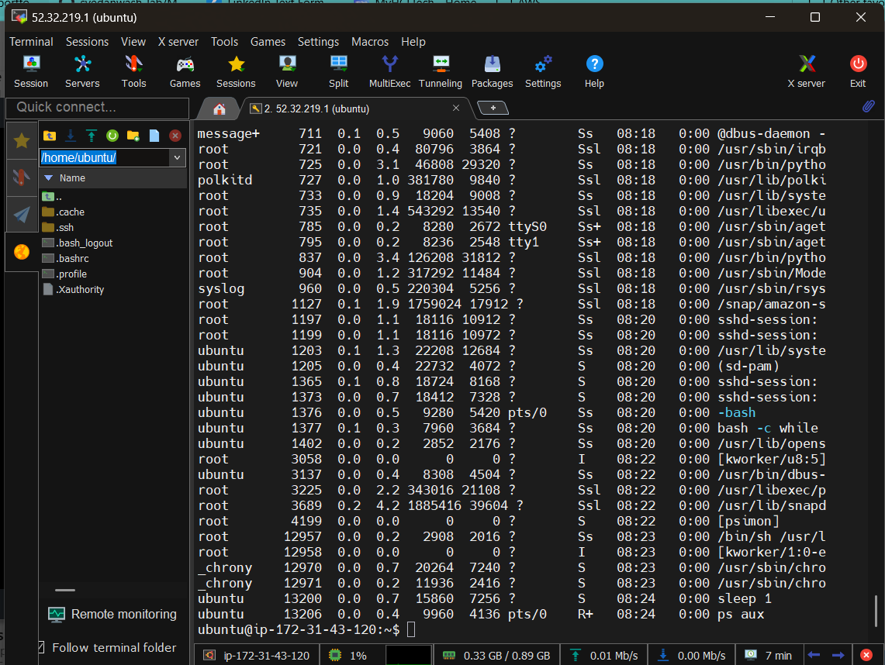
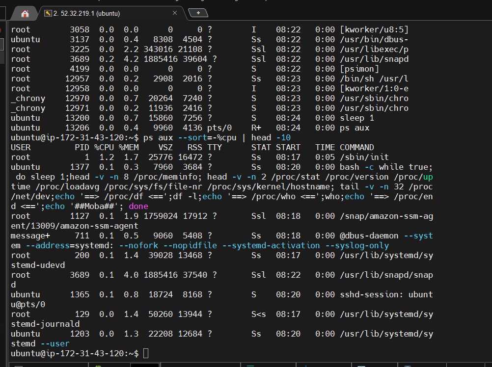
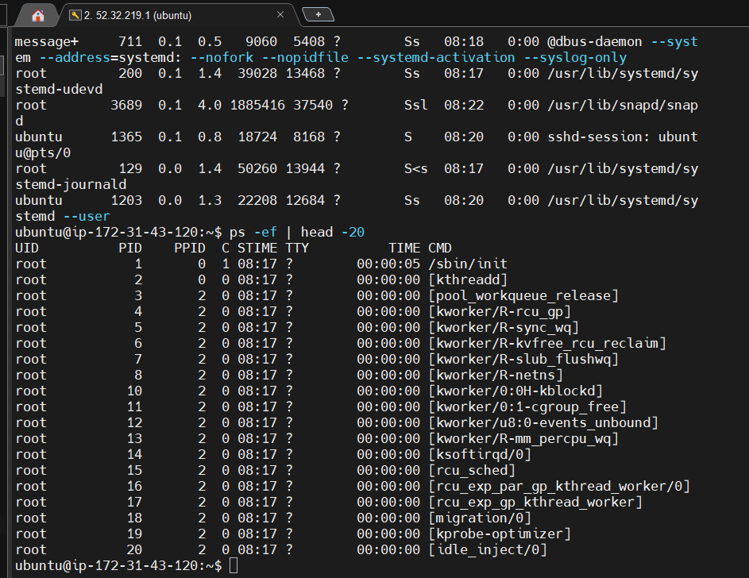
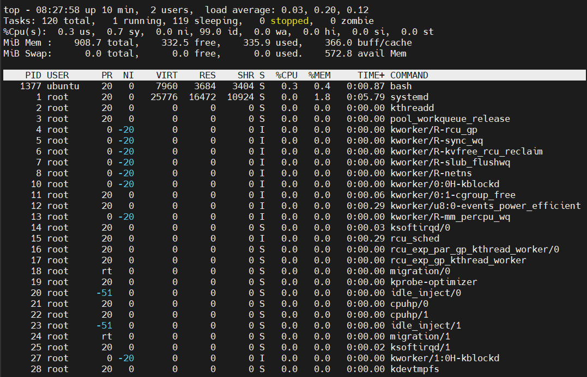
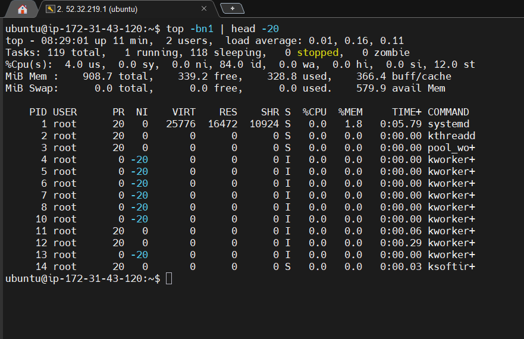
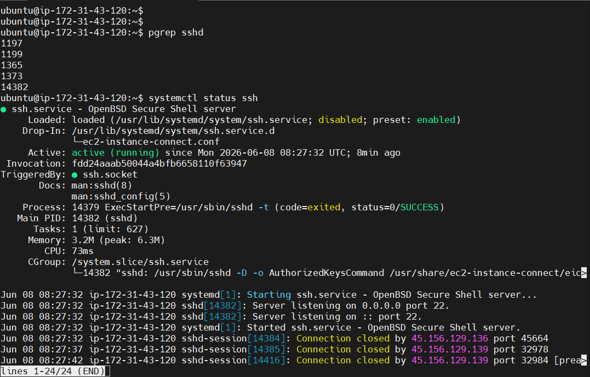
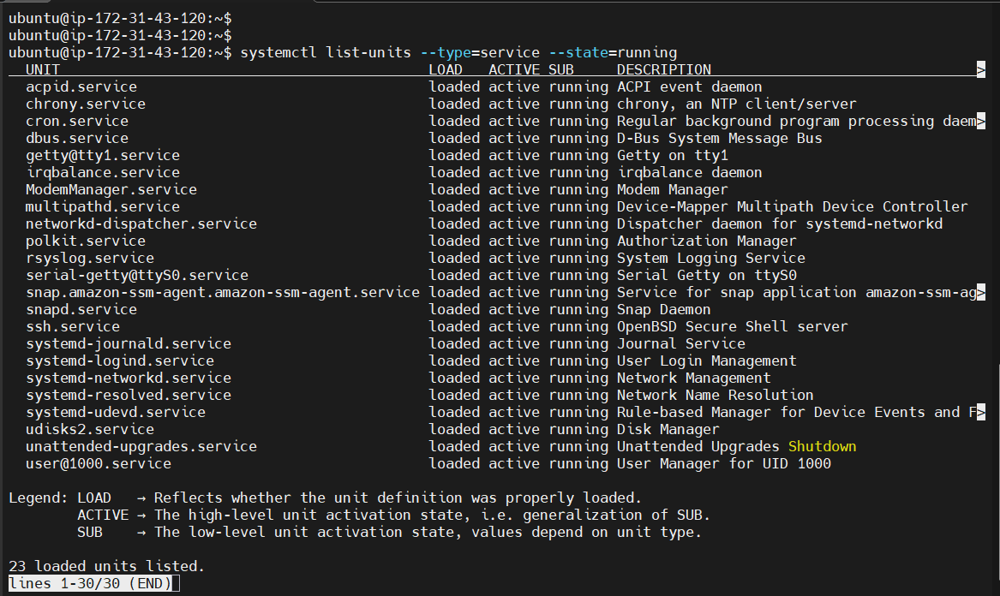
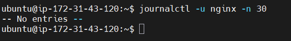
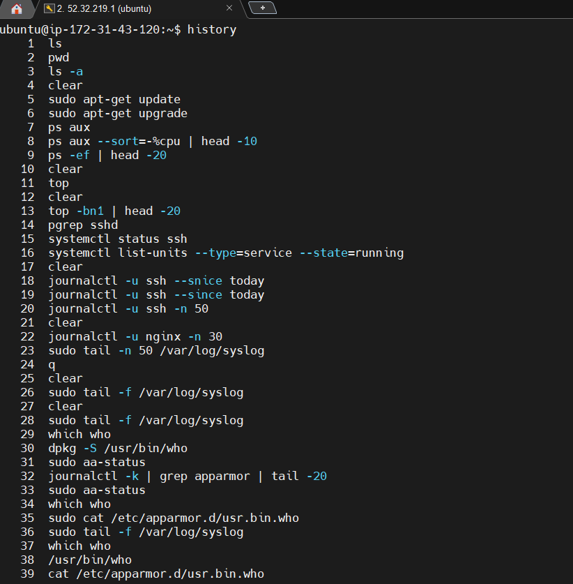
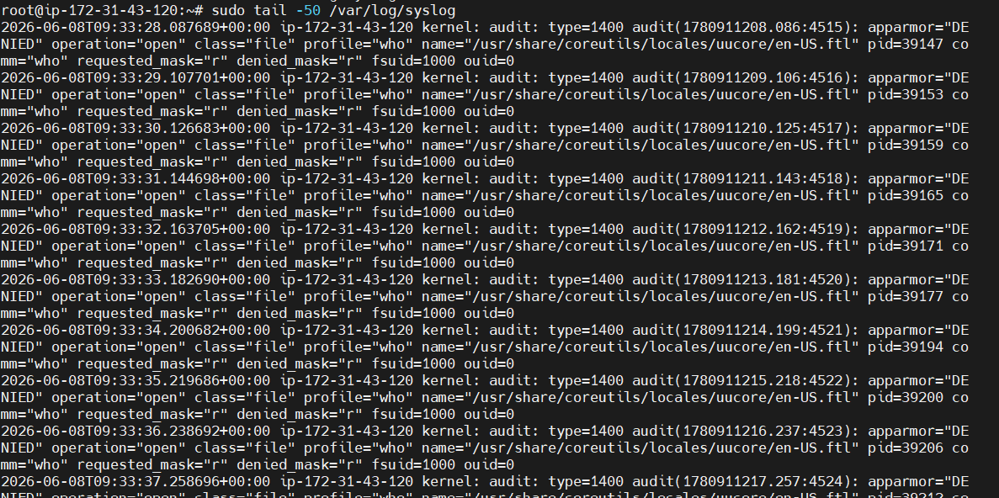

# Day 04 – Linux Practice: Processes and Services
**Date:** 2026-05-19  
**Goal:** Hands-on practice with process inspection, service management, and log reading.

---

## 1. Process Checks

### Command 1: `ps aux` — List all running processes
```bash
$ ps aux --sort=-%cpu | head -10
```
**Output:**


**What I learned:**
- `ps aux` shows ALL processes for ALL users
- Columns: USER, PID, %CPU, %MEM, STAT (R=running, S=sleeping, I=idle kernel thread)
- Sorted by `-%cpu` so highest CPU consumers appear first
- PID 1 is always the init/root process

---

### Command 2: `top -bn1` — Real-time process snapshot (one-shot)
```bash
$ top -bn1 | head -20
```
**Output:**



**What I learned:**
- `load average: 0.00` = system is idle (1min, 5min, 15min averages)
- `wa = 0.0` = no disk I/O wait — healthy!
- `-bn1` flag: batch mode, 1 iteration — great for scripting/logging
- Zombie processes (Z state) = processes not cleaned up by parent

---

### Command 3: `ps -ef` — Full process tree with parent PIDs
```bash
$ ps -ef | head -15
```
**Output:**

```
UID        PID  PPID  C STIME TTY          TIME CMD
root         1     0 11 04:23 ?        00:00:01 /process_api --firecracker-init
root         2     0  0 04:23 ?        00:00:00 [kthreadd]
root         3     2  0 04:23 ?        00:00:00 [pool_workqueue_release]
root        14     2  0 04:23 ?        00:00:00 [ksoftirqd/0]
root        15     2  0 04:23 ?        00:00:00 [rcu_preempt]
```
**What I learned:**
- PPID = Parent Process ID — shows who spawned each process
- `[kthreadd]` (PID 2) = kernel thread daemon, parent of all kernel threads
- Kernel threads shown in `[brackets]`
- PID 1's PPID is 0 (kernel itself)

---

## 2. Service Checks

### Command 4: `systemctl status ssh` — Inspect SSH service
```bash
$ systemctl status ssh
```
> *Note: In this minimal environment, systemd services are not running. On a full Ubuntu/CentOS server this is what you'd see:*

**Expected Output (on a real server):**


**What to look for:**
- `Active: active (running)` = service is healthy ✅
- `Active: failed` = service crashed ❌
- `enabled` = starts automatically on boot
- `Main PID` = the actual process ID of the service

---

### Command 5: `systemctl list-units --type=service --state=running`
```bash
$ systemctl list-units --type=service --state=running
```
**Expected Output (on a real server):**



**What I learned:**
- Lists ONLY services that are currently running (not stopped/failed)
- Use `--state=failed` to see broken services quickly
- Use `--all` to see every service regardless of state

---

## 3. Log Checks

### Command 6: `journalctl -u ssh --since today` — Service-specific logs
```bash
$ journalctl -u ssh --since today
$ journalctl -u ssh -n 50    # last 50 lines of ssh logs
```
**Expected Output (on a real server):**



**What I learned:**
- `journalctl -u <service>` = logs for ONE specific service
- `--since today` filters from midnight today
- `--since "1 hour ago"` = very useful for recent issues
- Failed login attempts visible here → security monitoring!

---

### Command 7: `tail -n 50 /var/log/syslog` — General system logs
```bash
$ tail -n 50 /var/log/syslog
# or on RHEL/CentOS:
$ tail -n 50 /var/log/messages
```
**Expected Output:**



**What I learned:**
- `/var/log/syslog` = Ubuntu/Debian. `/var/log/messages` = RHEL/CentOS
- `tail -f /var/log/syslog` = **live** log watching (follow mode) — used constantly in production
- Combine with `grep`: `tail -n 100 /var/log/syslog | grep ERROR`

---

### Command 8 (Bonus): System resource check
```bash
$ uptime
04:23:14 up 0 min,  0 user,  load average: 0.00, 0.00, 0.00

$ free -h
               total        used        free      shared  buff/cache   available
Mem:           3.9Gi       219Mi       3.8Gi       4.2Mi        87Mi       3.7Gi
Swap:             0B          0B          0B         0B

$ df -h
Filesystem      Size  Used Avail Use% Mounted on
/dev/vda        252G  8.6G   10G  47% /
```
**What I learned:**
- `free -h`: human-readable memory. `buff/cache` is reusable by OS — not really "used"
- `df -h`: disk usage. Watch for `Use%` above 85% — that's a production alert!
- `uptime`: load average above `(number of CPUs)` = system overloaded

---

## 4. Mini Troubleshooting Flow

**Scenario:** SSH service is not responding. What do I check?

```bash
# Step 1: Is the service running?
systemctl status ssh

# Step 2: If failed, check WHY it failed
journalctl -u ssh -n 50 --no-pager

# Step 3: Try to restart it
sudo systemctl restart ssh

# Step 4: Check if it came back up
systemctl is-active ssh

# Step 5: Check if port 22 is listening
ss -tlnp | grep :22
# or
netstat -tlnp | grep :22

# Step 6: Check system resources (maybe OOM killed it?)
free -h
dmesg | tail -20 | grep -i kill
```
# AppArmor `who` Command Troubleshooting

## Problem

The `who` command was returning **no output**, and `/var/log/syslog` was flooded with repeated AppArmor denial errors every second:

```
kernel: audit: type=1400 apparmor="DENIED" operation="open" class="file"
profile="who" name="/usr/share/coreutils/locales/uucore/en-US.ftl"
requested_mask="r" denied_mask="r" fsuid=1000 ouid=0
```

---

## Root Cause

Two issues were identified:

1. **Incomplete AppArmor profile** — The profile for `/usr/bin/who` was missing essential read permissions for locale files, utmp, and wtmp.
2. **MobaXterm remote monitoring script** — A `while true` bash loop (PID 1377) was running `who` every second in the background as part of MobaXterm's built-in server monitoring feature (identifiable by `##Moba##` in the script output).

---

## Fix 1: Repair the AppArmor Profile

Replace the incomplete profile with a full working one:

```bash
sudo tee /etc/apparmor.d/usr.bin.who << 'EOF'
#include <tunables/global>

/usr/bin/who {
  #include <abstractions/base>
  #include <abstractions/consoles>

  /usr/bin/who mr,
  /run/utmp r,
  /var/log/wtmp r,
  /usr/share/coreutils/locales/** r,
  /usr/lib/locale/** r,
  /usr/share/locale/** r,
  /proc/*/loginuid r,
}
EOF
```

Reload the profile:

```bash
sudo apparmor_parser -r /etc/apparmor.d/usr.bin.who
```

Verify `who` works:

```bash
who
w
```

---

## Fix 2: Stop MobaXterm Remote Monitoring

The background script was detected via:

```bash
ps aux | grep who
# Output showed: bash -c while true; do ... /proc/who ... ##Moba## ...
```

### Temporary fix (kill the process):

```bash
sudo kill 1377
```

### Permanent fix (disable in MobaXterm):

1. Open **MobaXterm** on your local machine
2. Go to **Settings → SSH**
3. Disable **"Remote monitoring"**

> This prevents MobaXterm from sending the monitoring script on every SSH connection.

---

## Verification

After both fixes, syslog should be clean:

```bash
sudo tail -f /var/log/syslog
# No more AppArmor DENIED entries for "who"
```

```bash
w
# Should show logged-in users correctly
```

---

## Summary

| Issue | Cause | Fix |
|-------|-------|-----|
| `who` returns no output | AppArmor profile missing `/run/utmp`, `/var/log/wtmp`, locale permissions | Updated AppArmor profile with full permissions |
| Syslog flooded with denials | MobaXterm monitoring loop running `who` every second | Killed PID + disabled MobaXterm remote monitoring |

**Decision tree:**
```
Service down?
├── Active: failed  →  journalctl -u <service> → find the error → fix config → restart
├── Active: inactive → systemctl start <service> → check status again
└── Active: running but not responding → check port with ss/netstat → check firewall
```

---
**Expected Output:**





## Key Commands Summary

| Command | Purpose |
|---|---|
| `ps aux` | All processes, sorted by CPU |
| `top -bn1` | One-shot live system snapshot |
| `ps -ef` | Full process tree with PPIDs |
| `pgrep <name>` | Find PID of a process by name |
| `systemctl status <svc>` | Service health + recent logs |
| `systemctl list-units --type=service` | All running services |
| `journalctl -u <svc> -n 50` | Last 50 lines of service logs |
| `tail -f /var/log/syslog` | Live system log stream |
| `free -h` | Memory usage |
| `df -h` | Disk usage |

---

## What I Learned Today

1. `ps aux` and `top` are my first tools when something feels slow
2. Always check `journalctl -u <service>` before restarting anything — know WHY it failed
3. `tail -f` is your live window into what the system is doing right now
4. Load average > number of CPUs = investigate immediately
5. `systemctl status` gives you the last few log lines inline — very convenient