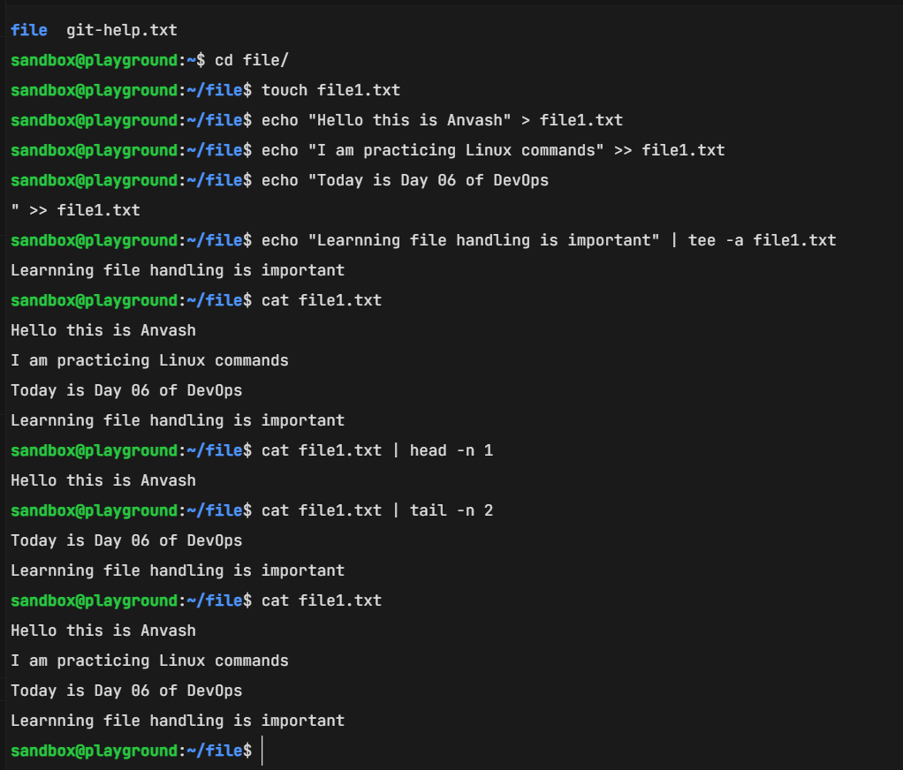

# Read and Write text files in Linux

* `touch file1.txt`

   Create a text file with name file1.txt

* `echo "Hello this is Anvash" > file1.txt`

   Write data into file1.txt

* `echo "I am practicing Linux commands" >> file1.txt`

* `echo "Today is Day 06 of DevOps" >> file1.txt`

   Append new lines into file1.txt

* `echo "Learning file handling is important" | tee -a file1.txt`

   Write using tee command and print output on terminal  
   `-a` is used for append mode

* `cat file1.txt`

   Read complete file1.txt file

* `cat file1.txt | head -n 1`

   Read first line of file1.txt

* `cat file1.txt | tail -n 2`

   Read last two lines of file1.txt

## Hands on of above commands

< />
