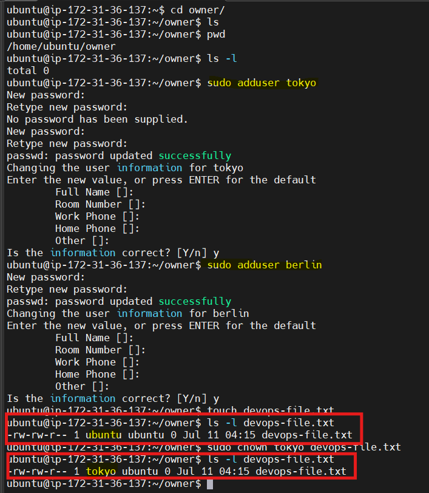
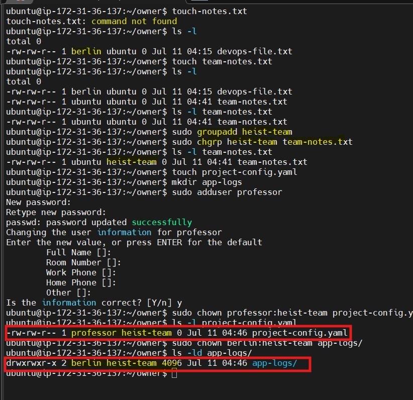
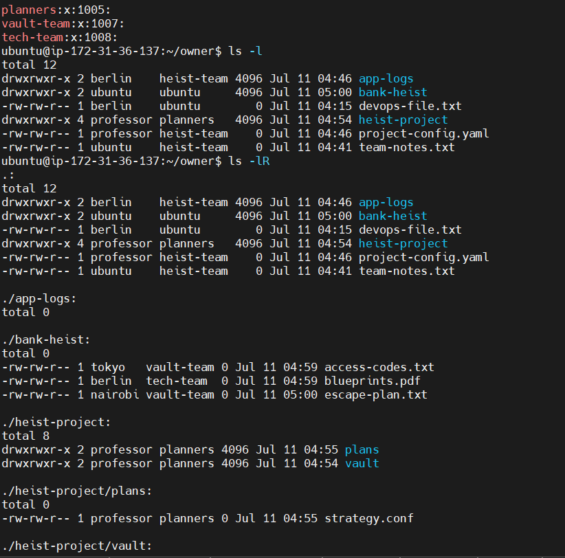
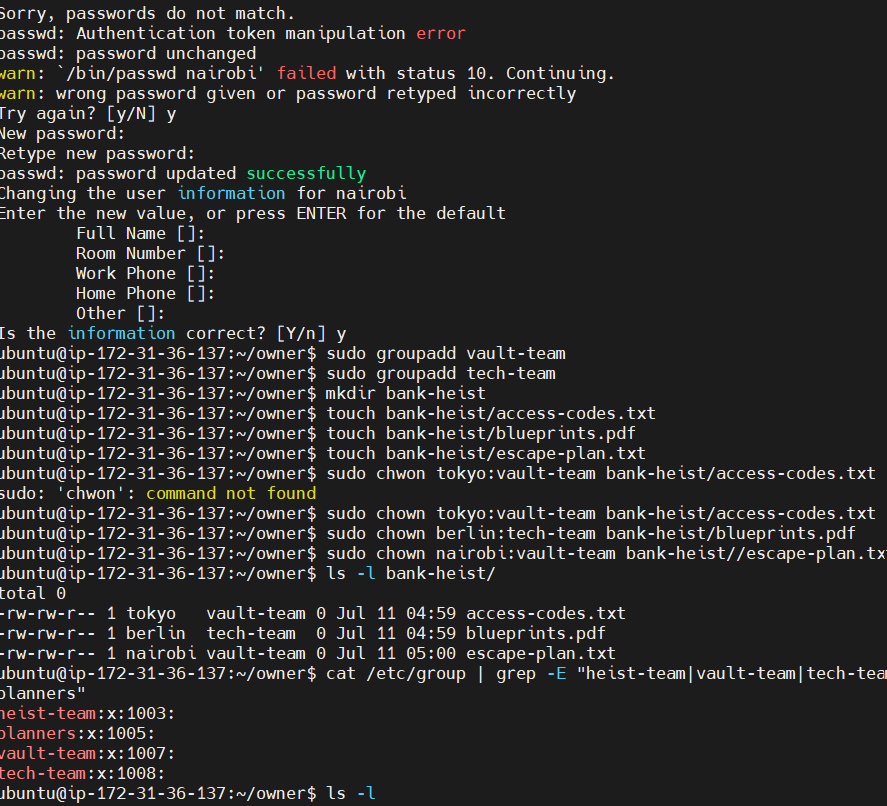

# Day 11 – Linux Practice: File Ownership & Permissions

**Date:** 2026-07-11  
**Goal:** Learn how Linux file ownership works and practice changing file owners and groups using `chown` and `chgrp`.

---

# 1. Understanding File Ownership

## Command 1: View file ownership

```bash
pwd
ls -l
```

### Sample Output

```text
drwxr-xr-x 2 ubuntu ubuntu 4096 Jul 11 Documents
-rw-r--r-- 1 ubuntu ubuntu   25 Jul 11 notes.txt
```

### What I Learned

- The **first column** represents file permissions.
- The **third column** is the **Owner** (user).
- The **fourth column** is the **Group**.
- Every file belongs to one user and one group.

---

## Owner vs Group

| Owner | Group |
|--------|-------|
| User who owns the file | Collection of users sharing access |
| Has primary control over file permissions | Members inherit group permissions |
| Changed using `chown` | Changed using `chgrp` or `chown` |


---

# 2. Basic chown Operations

## Create a file

```bash
touch devops-file.txt
ls -l devops-file.txt
```

### Before

```text
-rw-rw-r-- 1 ubuntu ubuntu 0 Jul 11 devops-file.txt
```

---

## Change owner to tokyo

```bash
sudo useradd tokyo
sudo chown tokyo devops-file.txt
```

Verify

```bash
ls -l devops-file.txt
```

Output

```text
-rw-rw-r-- 1 tokyo ubuntu 0 Jul 11 devops-file.txt
```

---

## Change owner to berlin

```bash
sudo useradd berlin
sudo chown berlin devops-file.txt
```

Verify

```bash
ls -l devops-file.txt
```

Output

```text
-rw-rw-r-- 1 berlin ubuntu 0 Jul 11 devops-file.txt
```

---

# 3. Basic chgrp Operations

Create file

```bash
touch team-notes.txt
```

Current group

```bash
ls -l team-notes.txt
```

Create group

```bash
sudo groupadd heist-team
```

Change group

```bash
sudo chgrp heist-team team-notes.txt
```

Verify

```bash
ls -l team-notes.txt
```

Output

```text
-rw-rw-r-- 1 ubuntu heist-team 0 Jul 11 team-notes.txt
```

---

# 4. Change Owner and Group Together

Create file

```bash
touch project-config.yaml
```

Create user

```bash
sudo useradd professor
```

Change owner and group

```bash
sudo chown professor:heist-team project-config.yaml
```

Verify

```bash
ls -l project-config.yaml
```

Output

```text
-rw-rw-r-- 1 professor heist-team 0 Jul 11 project-config.yaml
```

---

## Directory Ownership

Create directory

```bash
mkdir app-logs
```

Change ownership

```bash
sudo chown berlin:heist-team app-logs
```

Verify

```bash
ls -ld app-logs
```

---

# 5. Recursive Ownership

Create directory structure

```bash
mkdir -p heist-project/vault
mkdir -p heist-project/plans

touch heist-project/vault/gold.txt
touch heist-project/plans/strategy.conf
```

Create group

```bash
sudo groupadd planners
```

Recursive ownership

```bash
sudo chown -R professor:planners heist-project
```

Verify

```bash
ls -lR heist-project
```

Sample Output

```text
heist-project:
drwxr-xr-x professor planners vault
drwxr-xr-x professor planners plans

vault:
-rw-r--r-- professor planners gold.txt

plans:
-rw-r--r-- professor planners strategy.conf
```

---

# 6. Practice Challenge

Create users

```bash
sudo useradd tokyo
sudo useradd berlin
sudo useradd nairobi
```

Create groups

```bash
sudo groupadd vault-team
sudo groupadd tech-team
```

Create directory

```bash
mkdir bank-heist
```

Create files

```bash
touch bank-heist/access-codes.txt
touch bank-heist/blueprints.pdf
touch bank-heist/escape-plan.txt
```

Assign ownership

```bash
sudo chown tokyo:vault-team bank-heist/access-codes.txt

sudo chown berlin:tech-team bank-heist/blueprints.pdf

sudo chown nairobi:vault-team bank-heist/escape-plan.txt
```

Verify

```bash
ls -l bank-heist
```

Sample Output

```text
-rw-r--r-- tokyo   vault-team access-codes.txt
-rw-r--r-- berlin  tech-team  blueprints.pdf
-rw-r--r-- nairobi vault-team escape-plan.txt
```

---

# Key Commands Used

```bash
ls -l
ls -ld
ls -lR

touch

mkdir -p

sudo useradd

sudo groupadd

sudo chown

sudo chgrp

sudo chown owner:group

sudo chown -R owner:group directory
```

---

# Files & Directories Created

## Files

- devops-file.txt
- team-notes.txt
- project-config.yaml
- access-codes.txt
- blueprints.pdf
- escape-plan.txt
- gold.txt
- strategy.conf

## Directories

- app-logs
- heist-project
- heist-project/vault
- heist-project/plans
- bank-heist

---

# Ownership Changes

| File | Before | After |
|------|--------|-------|
| devops-file.txt | ubuntu:ubuntu | berlin:ubuntu |
| team-notes.txt | ubuntu:ubuntu | ubuntu:heist-team |
| project-config.yaml | ubuntu:ubuntu | professor:heist-team |
| app-logs | ubuntu:ubuntu | berlin:heist-team |
| heist-project | ubuntu:ubuntu | professor:planners |
| access-codes.txt | ubuntu:ubuntu | tokyo:vault-team |
| blueprints.pdf | ubuntu:ubuntu | berlin:tech-team |
| escape-plan.txt | ubuntu:ubuntu | nairobi:vault-team |

---

# What I Learned

- Every Linux file has an **Owner** and a **Group** that determine access permissions.
- The `chown` command changes the file owner, while `chgrp` changes only the group ownership.
- Using the `-R` option with `chown` allows ownership changes to be applied recursively to directories and all their contents, which is essential for application deployments and shared environments.

---

# Why This Matters in DevOps

Proper file ownership is critical for:

- Secure application deployments
- Shared team directories
- Docker container file permissions
- CI/CD pipeline artifacts
- Log management
- Linux server administration
- Kubernetes persistent volumes