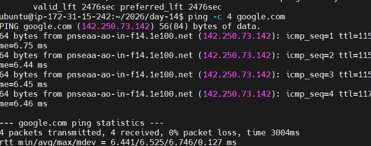
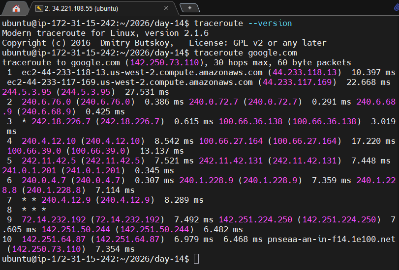
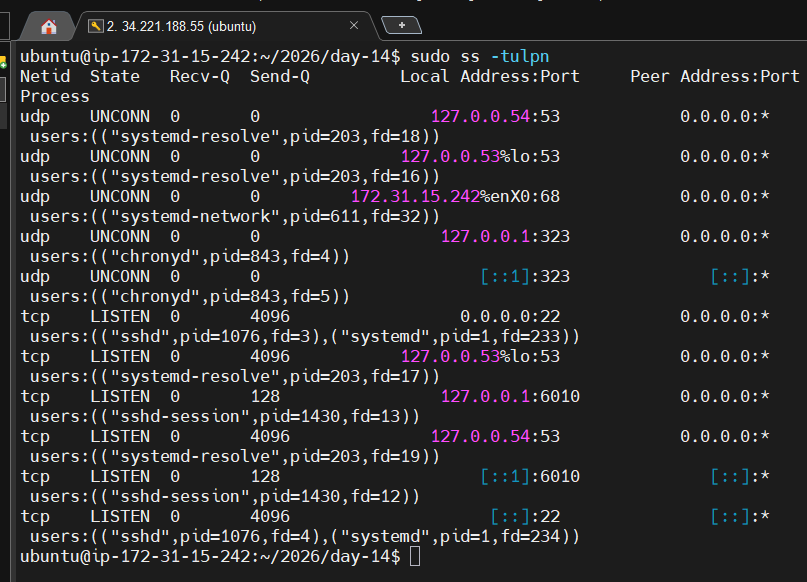
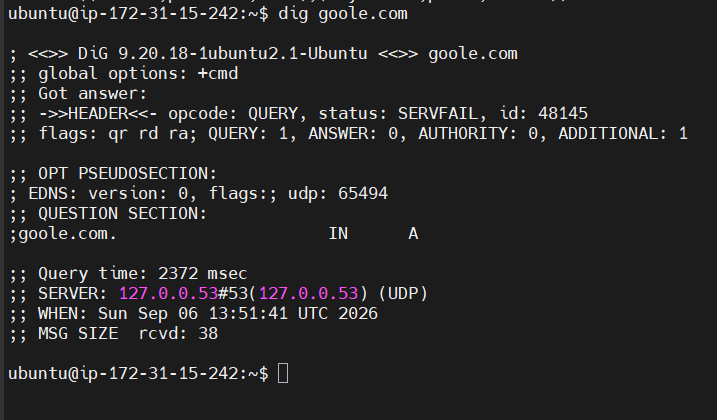
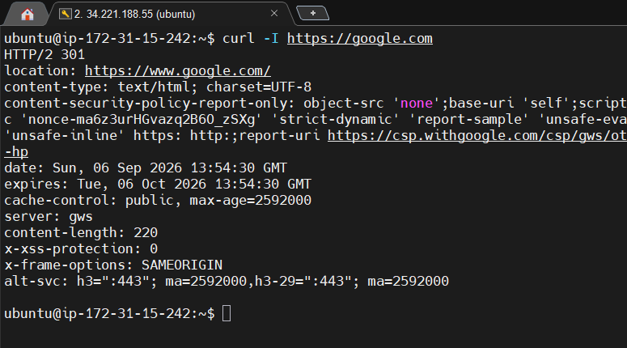
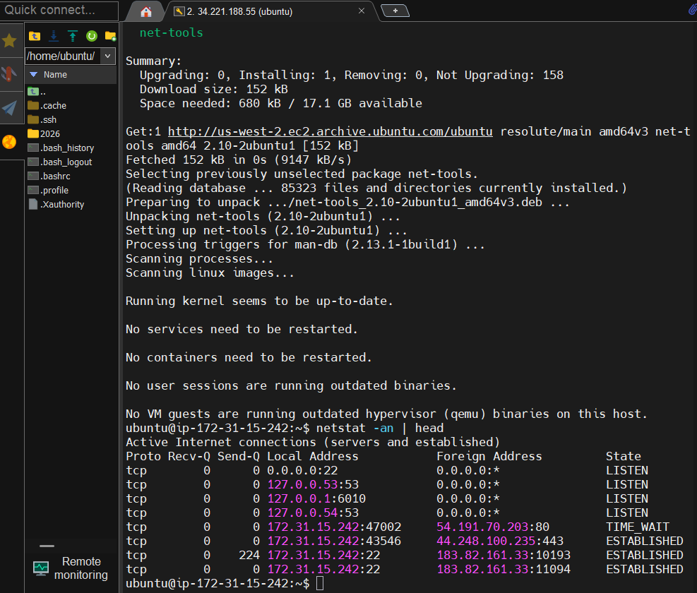
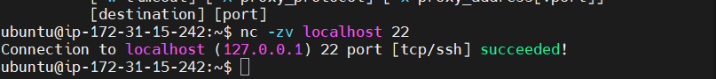

# Day 14 – Networking Fundamentals & Hands-on Checks

## Objective

Practiced core networking concepts and Linux networking commands used during DevOps troubleshooting.

---

## 1. OSI vs TCP/IP Model

### OSI Model

- L7 Application – HTTP, HTTPS, DNS
- L6 Presentation – Encryption and data representation
- L5 Session – Session management
- L4 Transport – TCP and UDP
- L3 Network – IP and ICMP
- L2 Data Link – Ethernet and MAC
- L1 Physical – Cables, signals and physical transmission

### TCP/IP Model

- Application – HTTP, HTTPS, DNS
- Transport – TCP and UDP
- Internet – IP and ICMP
- Link – Ethernet and ARP

### Protocol Mapping

| Protocol | Layer |
|---|---|
| HTTP/HTTPS | Application |
| DNS | Application |
| TCP | Transport |
| UDP | Transport |
| IP | Internet/Network |
| Ethernet | Link/Data Link |

### Real Example

`curl https://example.com` = Application layer over TCP over IP, with TLS providing HTTPS encryption.

---

## 2. Identity Check

### Command

```bash
hostname -I
My IP address:34.221.188.55
PASTE-YOUR-IP-HERE : 34.221.188.55

Observation
The command displayed the private IP address assigned to my Ubuntu EC2 instance.

3. Reachability Check
Command
ping -c 4 google.com
Result


Observation : Packet loss: XX%
Latency: XX ms approximately
Overall connectivity: Working/Not Working

4. Network Path
Command : traceroute google.com
Observation:
Number of visible hops: XX
Highest observed latency: XX ms
Timeouts: Yes/No

Some intermediate hops may not respond to traceroute probes.



5. Listening Ports
Command : sudo ss -tulpn
Listening Service Identified
Service: SSH
Port: 22
Protocol: TCP
Observation : SSH was listening on port 22.



6. DNS Resolution
Command : dig +short google.com
Resolved IP
PASTE-RESOLVED-IP-HERE


Observation : DNS successfully resolved google.com to an IP address.

7. HTTP Check
Command
curl -I https://example.com
HTTP Status
PASTE-STATUS-CODE-HERE


Observation : The server returned the HTTP status code shown above.

8. Connections Snapshot
Command : netstat -an | head


Observation: The output showed active network connections and listening sockets.

Approximate counts:
ESTABLISHED: XX
LISTEN: XX
--------------------------------------------
9. Mini Task – Port Probe
Listening Port
Port: 22
Service: SSH
Command : nc -zv localhost 22
Result
Paste output here.



Interpretation : The port is reachable locally because the connection test succeeded.
If it had failed, I would check the service status, listening sockets and firewall rules.
----------------------------------------------------
10. Reflection
Which command gives the fastest signal when something is broken?

ping provides a quick signal for basic network reachability. For application-level issues, curl provides a faster indication of whether the HTTP service is responding.

What layer would you inspect if DNS fails?

I would first investigate the Application layer because DNS operates there, while also checking network connectivity and DNS configuration.

What if HTTP 500 appears?

HTTP 500 indicates a server-side application problem. I would investigate the application/service logs, backend dependencies and server health.

Two follow-up checks in a real incident
Check listening ports and service status using ss and systemctl.
Check application/system logs and firewall/network rules.
----------------------------------------------------
11. Key Learnings
Learned how OSI and TCP/IP models map to common networking protocols.
Practiced Linux commands such as ping, traceroute, ss, dig, curl, and netstat.
Learned how to troubleshoot connectivity, DNS, ports and HTTP responses step by step.
