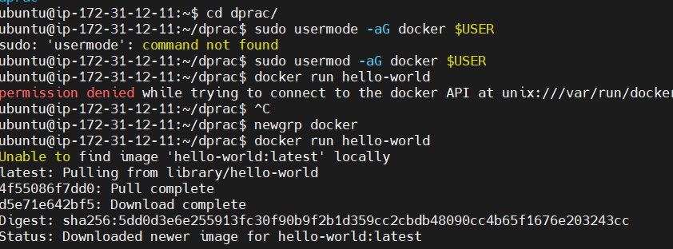
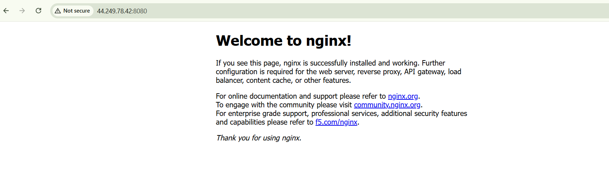
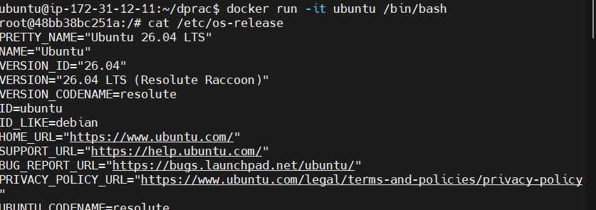
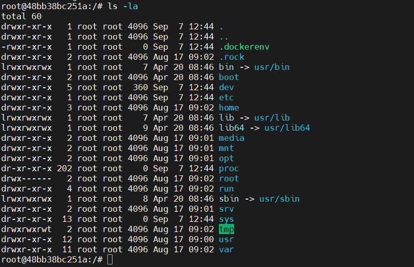
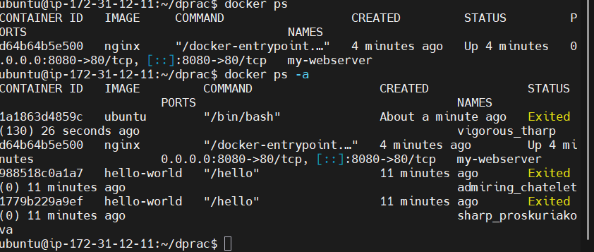
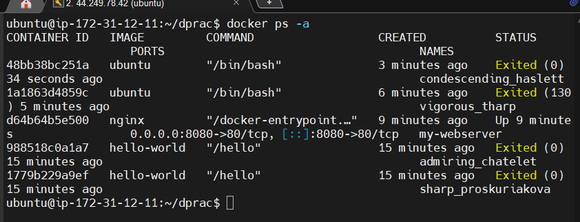
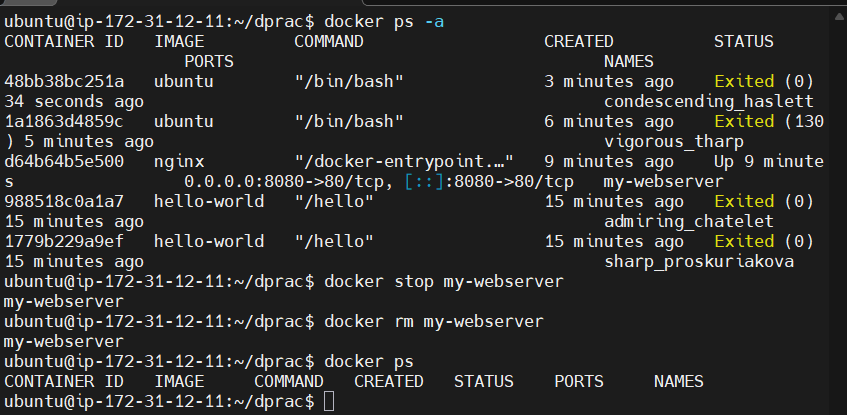
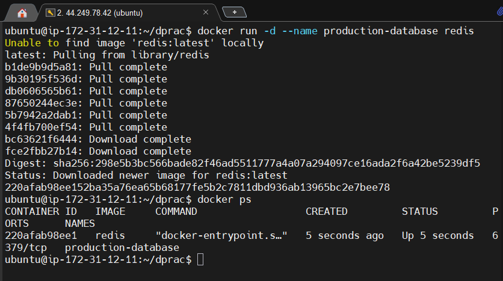
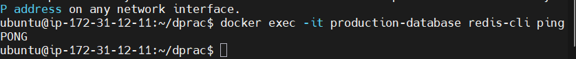

### Day 29: Introduction to Docker – Challenge Tasks

### Task 1: What is Docker?

### 1. What is a Container and Why Do We Need Them?

A **container** is a lightweight, isolated package of software that bundles an application's code together with all its specific libraries, configuration settings, and system dependencies required to execute seamlessly. 

We need containers because they solve the classic *"it works on my machine"* dilemma. Before containerization, discrepancies in underlying host configurations, library versions, and operating systems between a developer's desktop, testing environment, and production systems frequently caused deployment breakdowns. Containers abstract the application layer from the physical server infrastructure, guaranteeing identical application performance across any environment. 

### 2. Containers vs. Virtual Machines (VMs)

While both technologies offer execution isolation, they operate at completely different layers of the infrastructure stack: 

Feature 

Containers 

Virtual Machines (VMs) 

****Architecture****
Shares the host operating system's kernel.Includes a full guest operating system.
****Hypervisor****
Not required; managed directly via a container engine (e.g., Docker).Requires a Hypervisor (e.g., VMware, VirtualBox) to slice hardware.
****Resource Usage****
Highly efficient, minimal CPU/RAM overhead, sizing in megabytes.Heavy footprint, duplicate OS resources, sizing in gigabytes.
****Startup Time****
Starts instantly (fractions of a second to a few seconds).Slow boot time (minutes) due to full guest OS initialization.
****Isolation****
Process-level isolation (shared kernel security boundaries).Hardware-level isolation (complete sandbox environment).

### 3. The Docker Architecture

Docker operates on a standard **client-server architecture**. Below is the breakdown of its core components: 

* **Docker Client (docker)**: The primary command-line interface (CLI) that users interact with. When you execute commands like docker run or docker build, the client transmits these calls to the daemon.
* **Docker Daemon (dockerd)**: The persistent background service running on the host system. It listens for incoming Docker API requests and performs the heavy lifting of managing infrastructure objects like networks, volumes, images, and containers.
* **Docker Images**: Read-only, immutable blueprints used to instantiate environments. They contain stacked filesystem layers representing the packaged operating system utilities, libraries, and application code.
* **Docker Containers**: The active, runnable execution instances derived from a Docker image. They represent isolated, secure process spaces on the host machine.
* **Docker Registry**: A centralized distribution repository for storing and versioning Docker images. [Docker Hub](https://hub.docker.com/) is the default public registry used when pulling down pre-configured templates.

text

[ Docker Client ]  ---> REST API --->  [ Docker Daemon (Host) ] <---> [ Docker Registry ]
     (CLI Commands)                         |      |       |              (e.g., Docker Hub)
                                      Images  Containers  Networks

Use code with caution.

### Task 2: Install Docker

### 1. Installation Verification

After setting up the Docker engine on the host system, verify that both the CLI engine client and engine server run reliably: 

bash

docker --version

Use code with caution.

*Expected Output:* 

text

Docker version 27.1.1, build 6312585

Use code with caution.

### 2. Running the First Hello-World Container

Execute the initial test template from the public registry: 
NOTE: While running first hello-world container , I encountered a permission denied error.
Fix: We ran the following command to change the permissions.
sudo usermod -aG docker $USER
newgrp docker
docker run hello-world

bash

docker run hello-world

Use code with caution.

**What Just Happened Under the Hood?** 

1. The **Docker Client** contacted the local **Docker Daemon**.
2. The Daemon searched its local cache for an image named hello-world:latest and could not find it.
3. The Daemon **pulled** the missing asset down from the **Docker Hub** registry.
4. The Daemon generated a brand-new container instance utilizing that image blueprint.
5. The Daemon executed the containerized executable stream, emitting the standard output greeting directly to your terminal before safely terminating the runtime execution.

### Task 3: Run Real Containers

### 1. Run an Nginx Web Server

Instantiate a background Nginx reverse proxy web server: 

bash

docker run -d -p 8080:80 --name my-webserver nginx

Use code with caution.

* Open your browser and navigate to http://localhost:8080 to verify the generic "Welcome to nginx!" message page renders successfully.

### 2. Run an Interactive Ubuntu Container

Spin up a basic Linux instance to explore its isolated workspace shell interactively: 

bash

docker run -it ubuntu /bin/bash

Use code with caution.

*Inside the container, run these exploring commands to observe the sandbox:* 

bash

root@f3a8b29c12de:/# cat /etc/os-release

root@f3a8b29c12de:/# ls -la

root@f3a8b29c12de:/# exit

Use code with caution.

### 3. List Running Containers

View currently active running container processes: 

bash

docker ps

### 4. List All Containers (Including Stopped Ones)

View your full local lifecycle history: 

bash

docker ps -a

### 5. Stop and Remove a Container

Gracefully halt the Nginx background service and permanently drop the container from disk history: 

bash

docker stop my-webserver
docker rm my-webserver

### Task 4: Advanced Exploration

### 1. Detached Mode (-d) vs. Foreground Mode

When you run a container in **detached mode** using the -d flag, the container spins up quietly in the background. The terminal immediately hands control back to your prompt shell while returning the container's unique ID hash. Running *without* -d keeps the container locked onto your current terminal foreground, channeling application log stdout logs directly to your screen until interrupted. 

### 2. Custom Naming (--name)

Assigning descriptive tags prevents Docker from randomly selecting generated funny monikers (like boring_wozniak): 

bash

docker run -d --name production-database redis

### 3. Port Mapping (-p host:container)

Containers run inside enclosed networks. To let outside traffic hit them, you must map a **Host Port** to an internal **Container Port**. For instance, -p 8080:80 grabs incoming requests landing on your host machine's port 8080 and shunts them through to port 80 inside the container network space. 

### 4. Inspecting Logs (docker logs)

Check historical outputs thrown by detached background routines: 

bash

docker logs production-database

Use code with caution.

### 5. Execute Commands in a Running Container (docker exec)

Inject an additional shell session or command directly into a live, active runtime container environment: 

bash

docker exec -it production-database redis-cli ping

Use code with caution.

*Expected Output:* 

text

PONG

Use code with caution.