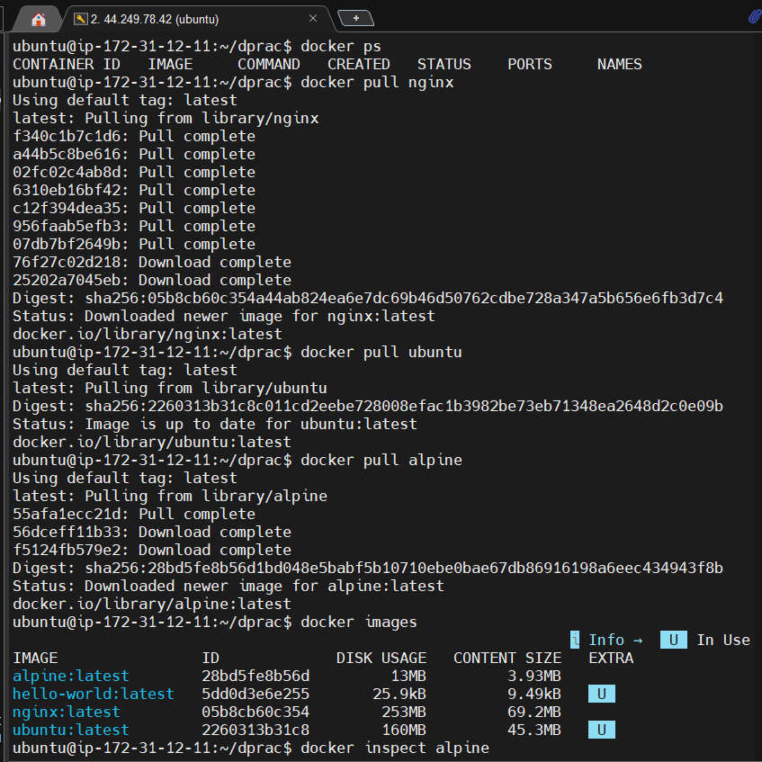
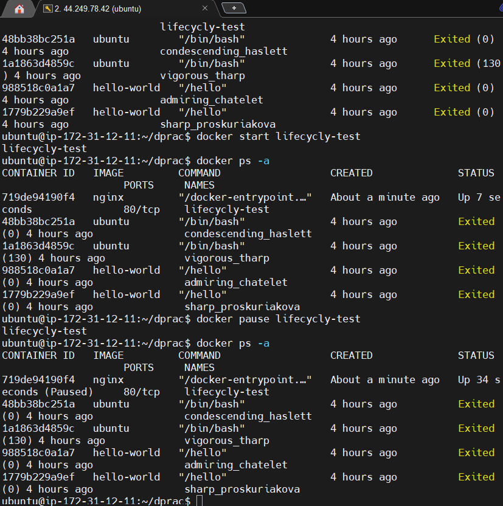
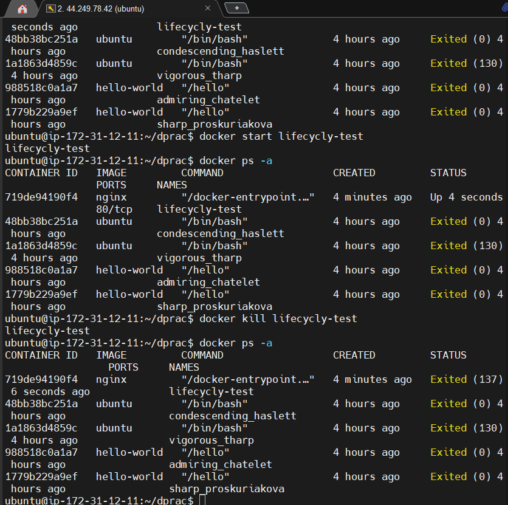
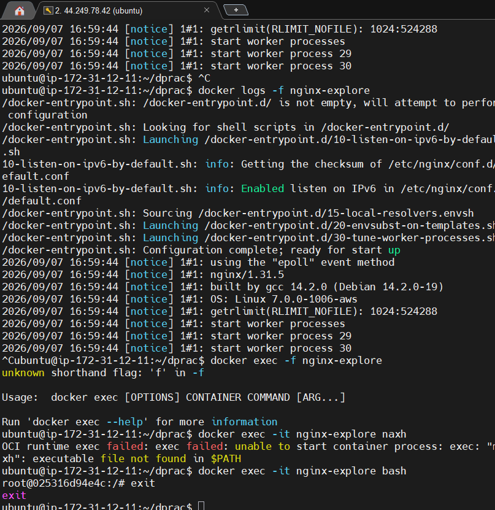
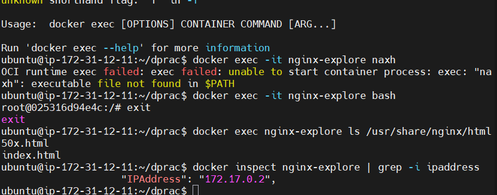
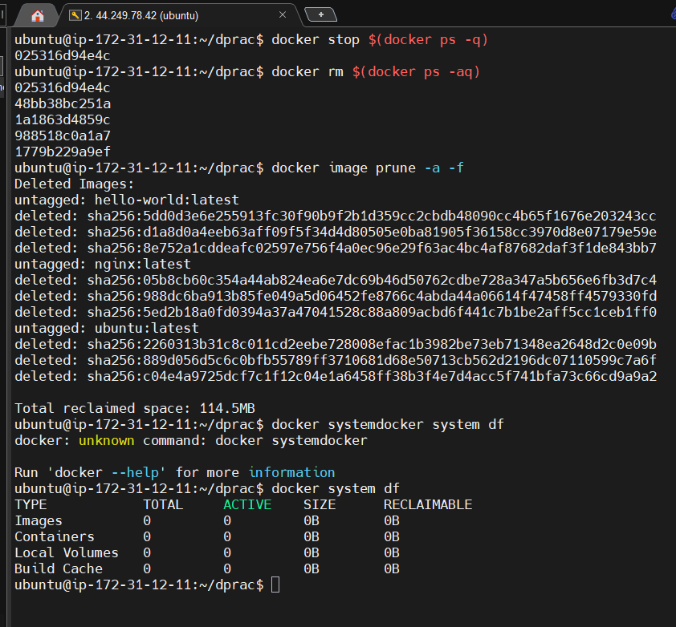
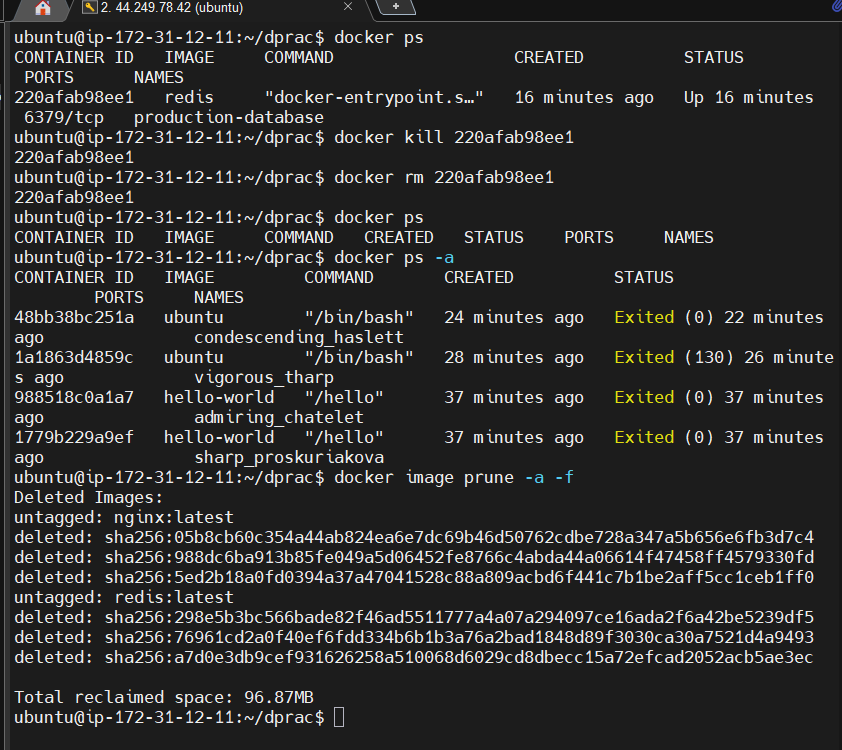
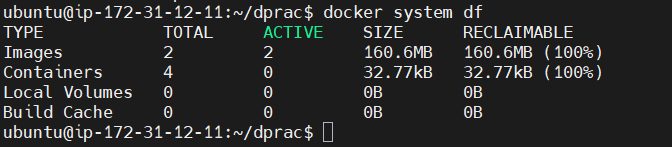
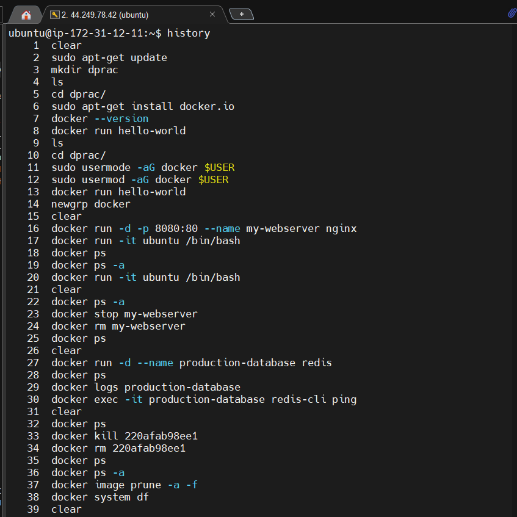
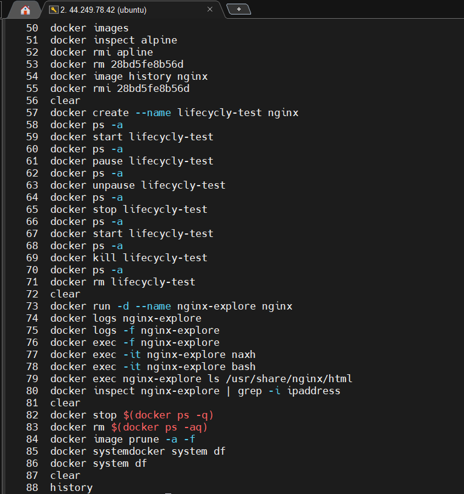

# Day 30 – Docker Images & Container Lifecycle

## Task
Today's goal is to **understand how images and containers actually work**.

You will:
- Learn the relationship between images and containers
- Understand image layers and caching
- Master the full container lifecycle

---

## Expected Output
- A markdown file: `day-30-images.md`
- Screenshots of key commands

---

## Challenge Tasks

### Task 1: Docker Images
1. Pull the `nginx`, `ubuntu`, and `alpine` images from Docker Hub
2. List all images on your machine — note the sizes
3. Compare `ubuntu` vs `alpine` — why is one much smaller?
4. Inspect an image — what information can you see?
5. Remove an image you no longer need

---

### Task 2: Image Layers
1. Run `docker image history nginx` — what do you see?
2. Each line is a **layer**. Note how some layers show sizes and some show 0B
3. Write in your notes: What are layers and why does Docker use them?

---

### Task 3: Container Lifecycle
Practice the full lifecycle on one container:
1. **Create** a container (without starting it)
2. **Start** the container
3. **Pause** it and check status
4. **Unpause** it
5. **Stop** it
6. **Restart** it
7. **Kill** it
8. **Remove** it

Check `docker ps -a` after each step — observe the state changes.

---

### Task 4: Working with Running Containers
1. Run an Nginx container in detached mode
2. View its **logs**
3. View **real-time logs** (follow mode)
4. **Exec** into the container and look around the filesystem
5. Run a single command inside the container without entering it
6. **Inspect** the container — find its IP address, port mappings, and mounts

---

### Task 5: Cleanup
1. Stop all running containers in one command
2. Remove all stopped containers in one command
3. Remove unused images

4. Check how much disk space Docker is using

---
### Day 30: Docker Images & Container Lifecycle – Challenge Tasks

### Task 1: Docker Images

### 1. Listing Local Images

bash

docker images

Use code with caution.

* **ubuntu**: ~78 MB
* **nginx**: ~140 MB
* **alpine**: ~7.8 MB

### 2. Comparison: Ubuntu vs. Alpine

alpine is drastically smaller than ubuntu because it is built explicitly for minimal container runtimes. It uses **musl libc** and **busybox** instead of the full GNU C library suite and standard core utilities. It lacks package managers like apt, system utilities, documentation files, and hardware kernels, leaving only the bare essentials needed to execute an application. 

### 3. Inspecting an Image

bash

docker inspect nginx

Use code with caution.

The output displays metadata in JSON format, containing structural configuration parameters including: 

* **Layers**: Cryptographic hashes of the filesystem changes.
* **Architecture**: Supported CPU build type (e.g., amd64).
* **Env**: Default environmental variables inside the workspace.
* **Cmd**: The execution command run by default at startup.

### Task 2: Image Layers

### 1. Examining Image History

bash

docker image history nginx

Use code with caution.

* **Observation**: You see vertical steps showing how the image was built. Some lines show physical sizes (like code copying or package installation), while others show 0B because they represent metadata mutations (like setting environments ENV, working directories WORKDIR, or port definitions EXPOSE).

### 2. What Are Layers and Why Does Docker Use Them?

Docker images are constructed as a stack of read-only filesystem modifications called **layers**. Every statement in a Dockerfile creates a new layer. 

* **Storage Efficiency**: If multiple images use the same base OS layer, they share that physical space on disk rather than duplicating it.
* **Speedy Building & Caching**: If a layer does not modify during development, Docker reuses the local cached version instead of rebuilding it, saving massive compilation time.

### Task 3: Container Lifecycle

Executing the state transitions reveals the following operational cycle: 

Step 

Command 

Resulting State 

docker ps -a Status Output 

****1. Create****
docker create --name test nginxCreatedCreated
****2. Start****
docker start testRunningUp X seconds
****3. Pause****
docker pause testPausedUp X seconds (Paused)
****4. Unpause****
docker unpause testRunningUp X seconds
****5. Stop****
docker stop testExited (Graceful)Exited (0) X seconds ago
****6. Restart****
docker restart testRunningUp 1 second
****7. Kill****
docker kill testExited (Forced)Exited (137) X seconds ago
****8. Remove****
docker rm testDestroyed*Container row completely removed*

*Note: Exit code 137 explicitly means the operating system process was forcefully terminated via a Linux SIGKILL signal.* 

### Task 4: Working with Running Containers

### 1. View Logs (Standard and Follow Mode)

bash

# Dump historical outputs
docker logs nginx-explore

# Stream real-time engine activity
docker logs -f nginx-explore

Use code with caution.

### 2. Execute Operations Inside the Sandbox

bash

# Interactive shell entry
docker exec -it nginx-explore bash

# Single-command runtime injection (without entering)
docker exec nginx-explore ls /usr/share/nginx/html

Use code with caution.

### 3. Container Inspect Filters

Extract specific target infrastructure strings directly using docker inspect: 

* **IP Address**: docker inspect --format='{{.NetworkSettings.IPAddress}}' nginx-explore
* **Port Mapping**: docker inspect --format='{{.NetworkSettings.Ports}}' nginx-explore
* **Mounts**: docker inspect --format='{{.Mounts}}' nginx-explore

### Task 5: Cleanup

Efficiently cleaning environment system resources via grouped arrays and systemic evaluation utilities: 

bash

# 1. Stop all running containers instantly
docker stop $(docker ps -q)

# 2. Delete all stopped container allocations
docker rm $(docker ps -aq)

# 3. Purge all unused cached image blueprints
docker image prune -a -f

# 4. Analyze remaining global disk footprints
docker system df

Use code with caution.
