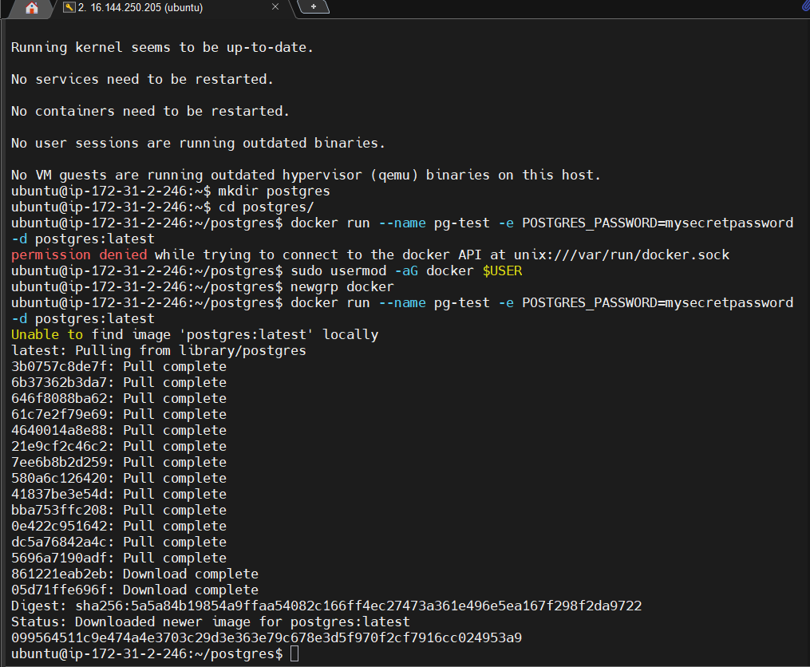
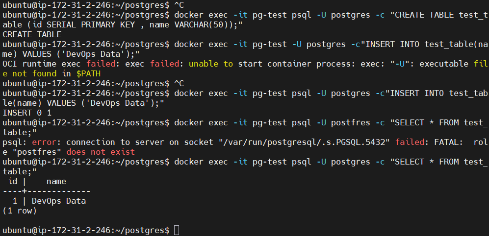
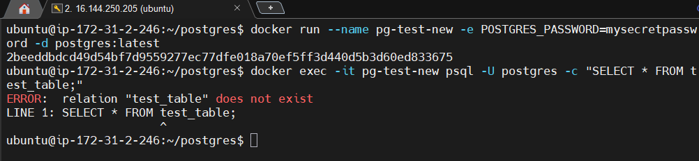
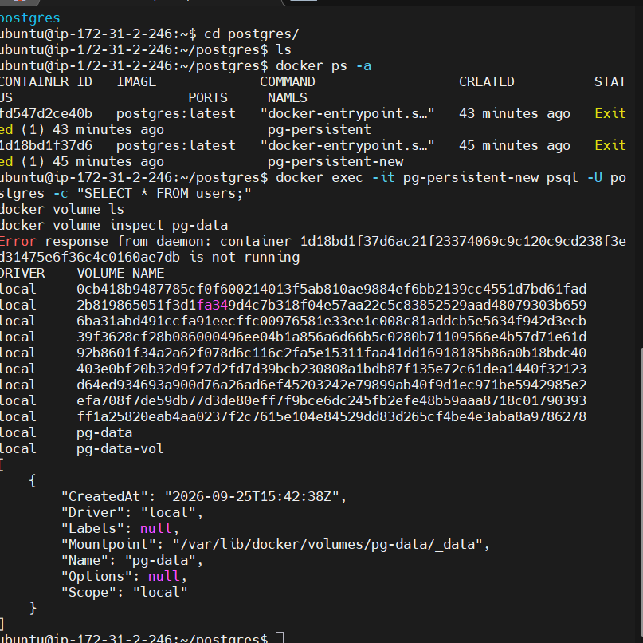
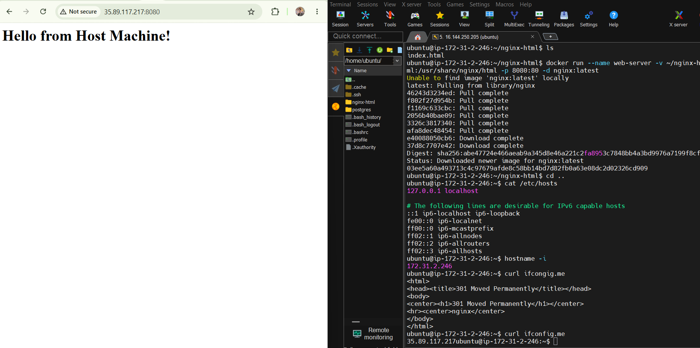
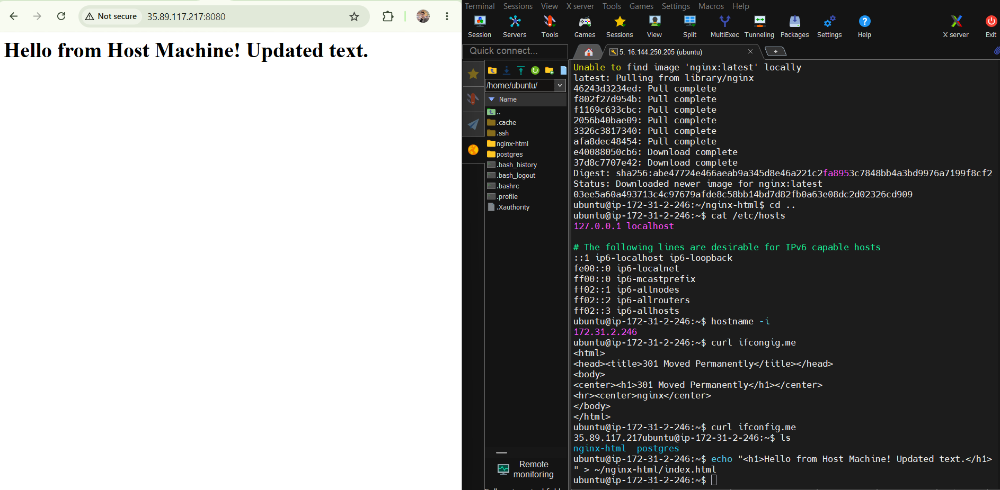
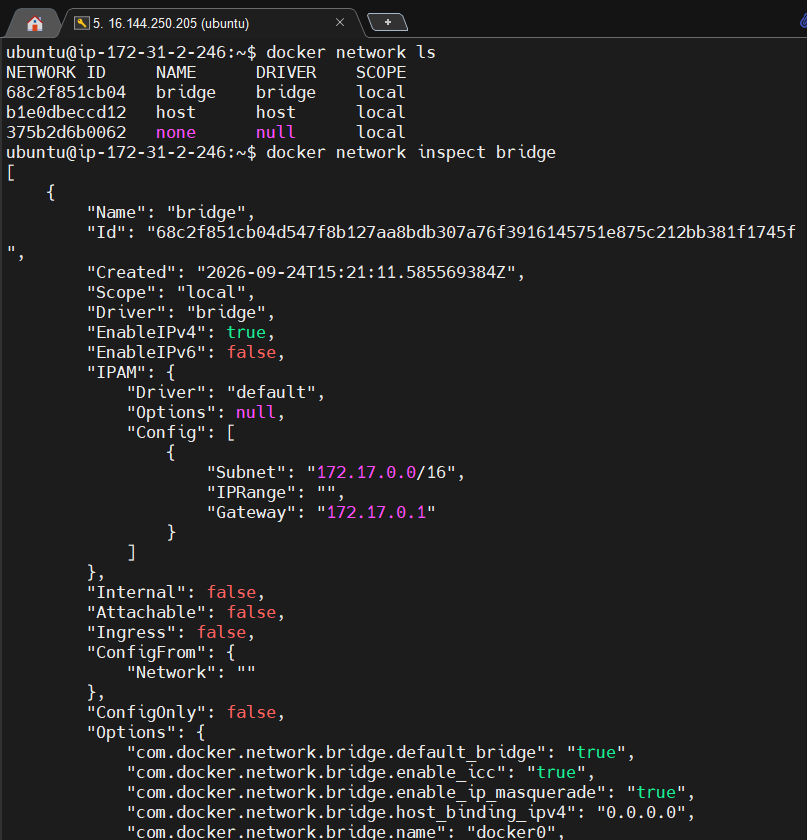
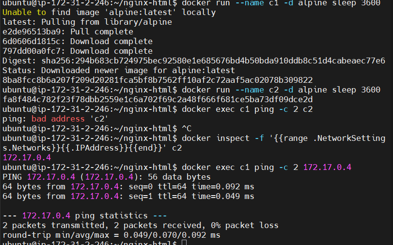
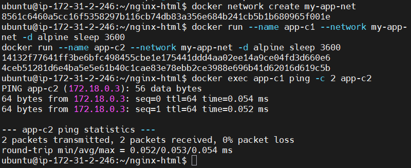
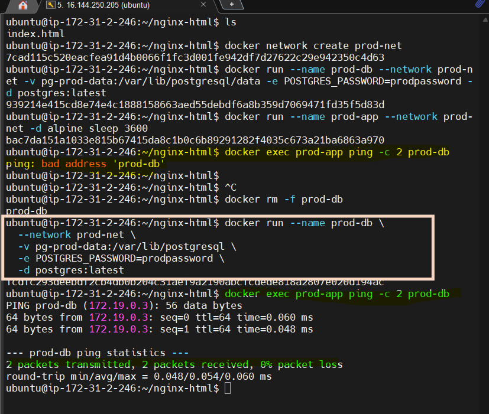

# Day 32 – Docker Volumes & Networking

## Challenge Objectives Completed
- Investigated container ephemerality and data loss.
- Configured Data Persistence using **Named Volumes** and **Bind Mounts**.
- Analyzed network discovery differences between default bridge networks and custom user-defined networks.

---

## Task 1: The Problem (Container Data Loss)
* **What I did:** Started a standalone Postgres container, generated a table with data, destroyed the container, and spun up a replacement.

* **Observation:** The new container did not have the original data table.
What happened and why (For your notes):The command throws an error stating relation "test_table" does not exist. The data is gone. This happens because containers are ephemeral by nature. Data written inside a container layer is tightly coupled to that container instance. When the container is deleted, its writable layer is permanently destroyed.
* **Reason:** Containers are inherently short-lived (ephemeral). All data generated inside a container is tied directly to its writable layer and gets wiped out when the container is deleted.

## Task 2: Named Volumes (Persistent Storage)
* **Verification:**
  - `docker volume ls` shows `pg-data-vol`.
  - Data successfully survived container destruction and deletion!
  

## Task 3: Bind Mounts
* **Named Volume vs Bind Mount:**

  | Feature | Named Volume | Bind Mount |
  | :--- | :--- | :--- |
  | **Storage Location** | Managed by Docker (`/var/lib/docker/volumes`) | Anywhere chosen on the host machine |
  | **Best For** | Production database files | Live code sharing / local web development |
  | **Management** | Handled completely via Docker CLI | Handled via Host OS filesystem |

  
  

## Task 4 & 5: Docker Networking Breakdown
* **Default Bridge Network:** Containers could communicate **only via IP address**. Pinging by container name failed.

Pinged container with its IP then got response

* **Custom Bridge Network:** Built-in automatic **DNS resolution** is active. Containers effortlessly discovered and pinged each other directly by container name.
Created a network namespace and run 2 alpine containers inside it , then both containers can communicate with each other.

## Task 6: Final Integrated Multi-Container Setup
Successfully deployed a localized network stack containing:
1. Custom Network: `production-net`
2. Backend Database: `prod-db` backed by persistent volume `pg-prod-data`
3. Application: `prod-app` communicating to `prod-db` cleanly using DNS name matching.

Obervation points:
Why container not communicate despite being in the same network?
 No, prod-app is currently not able to reach prod-db, even though they are on the same custom network (prod-net).The network configuration itself is perfect, but the connection failed because the prod-db container crashed immediately after starting and is not running.Why did prod-db crash?Just like in your previous steps, the postgres:latest image (PostgreSQL 18+) crashed because you explicitly mounted your volume to the legacy path (-v pg-prod-data:/var/lib/postgresql/data). The database guardrails caught the mismatch layout and stopped the container. When a container is stopped, its DNS name disappears from the custom network, causing ping to report bad address 'prod-db'

 FIX:
 You need to fix the PostgreSQL volume mount so the database container stays up and running.Run these cleanup and execution commands:bash# 1. Stop and remove the dead database container
docker rm -f prod-db

# 2. Re-run prod-db using the recommended PostgreSQL 18 root path
docker run --name prod-db \
  --network prod-net \
  -v pg-prod-data:/var/lib/postgresql \
  -e POSTGRES_PASSWORD=prodpassword \
  -d postgres:latest

