# Day 33: Docker Compose – Multi-Container Basics

## Task 1: Install & Verify
To check if Docker Compose is installed on the machine, run the following command:
```bash
docker compose version
```
*Output confirmation:* `Docker Compose version v2.x.x` (or applicable version installed).
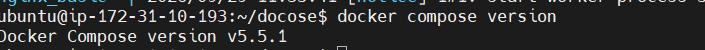
---

## Task 2: Your First Compose File
1. Created the directory `compose-basics`.
2. Created a basic `docker-compose.yml` mapped to port `8080:80` using the Nginx image.
3. Started the single container service:
   ```bash
   docker compose up -d
   ```
4. Accessed the Nginx default landing page via browser at `http://localhost:8080`.
5. Stopped and removed the container:
   ```bash
   docker compose down
   ```
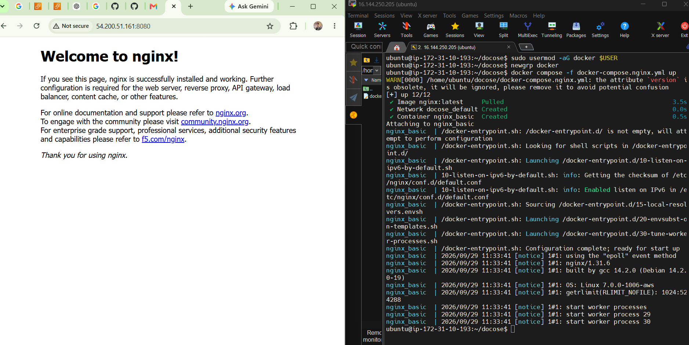

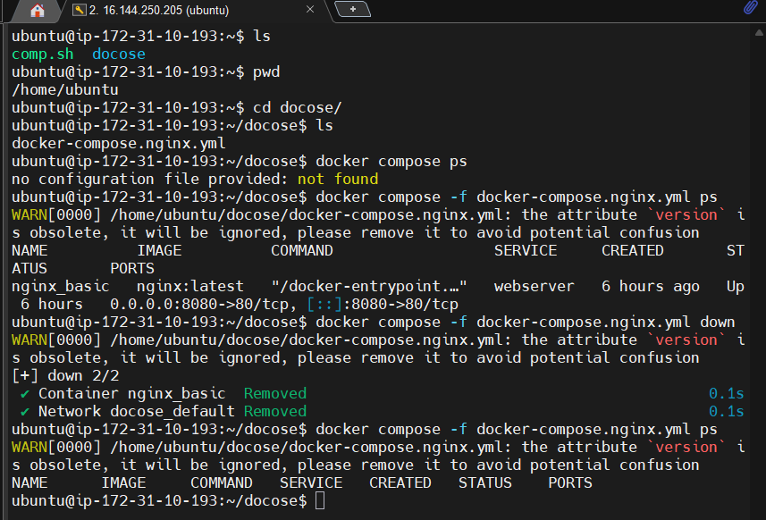

---

## Task 3: Two-Container Setup (WordPress + MySQL)
Using the multi-container configuration defined in `docker-compose.yml`:
* **Networking:** Both containers are automatically assigned to a default isolated bridge network created by Docker Compose. WordPress connects to the database using the service name `db` as its host address.
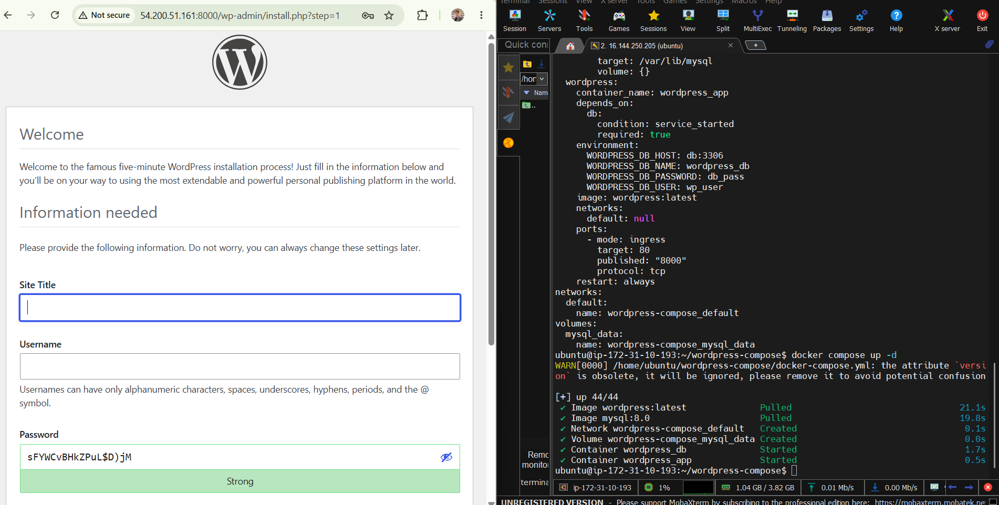

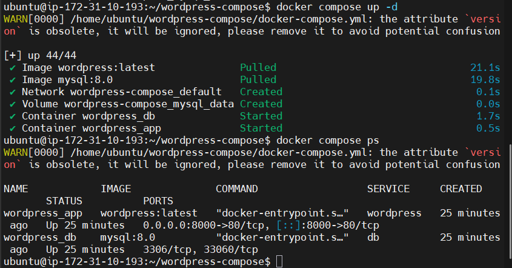

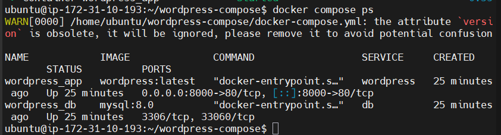

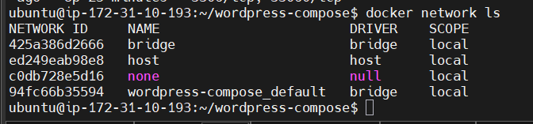

* **Persistence:** A named volume `mysql_data` is mounted to `/var/lib/mysql` to ensure data persists across container restarts.
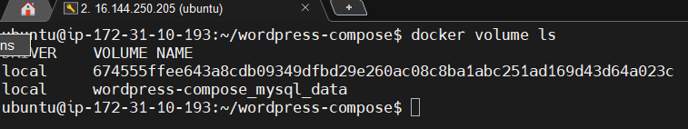

### Verification Test:
1. Started the application stack: `docker compose up -d`
2. Completed the initial WordPress setup wizard at `http://localhost:8000`.
3. Created a dummy test post.
4. Ran `docker compose down` to tear down the environment.
5. Ran `docker compose up -d` to spin it back up.
6. **Result:** Checked `http://localhost:8000`—the test post and configurations remained intact due to the named volume persistence.

---

## Task 4: Compose Commands Practice

### 1. Start services in detached mode
Runs containers in the background, freeing up the terminal.
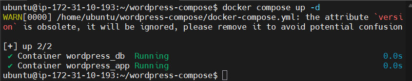

```bash
docker compose up -d
```

### 2. View running services
Lists the status, ports, and states of all containers managed by the current compose file.
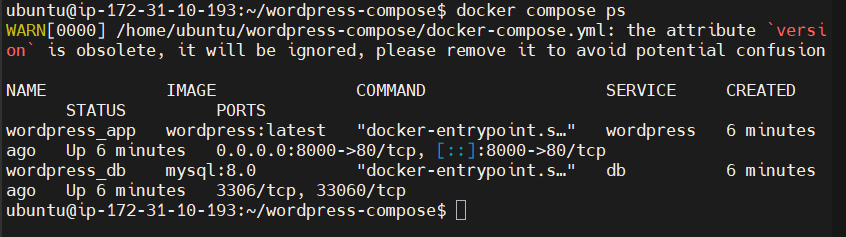
```bash
docker compose ps
```

### 3. View logs of all services
Streams logs from all containers concurrently.
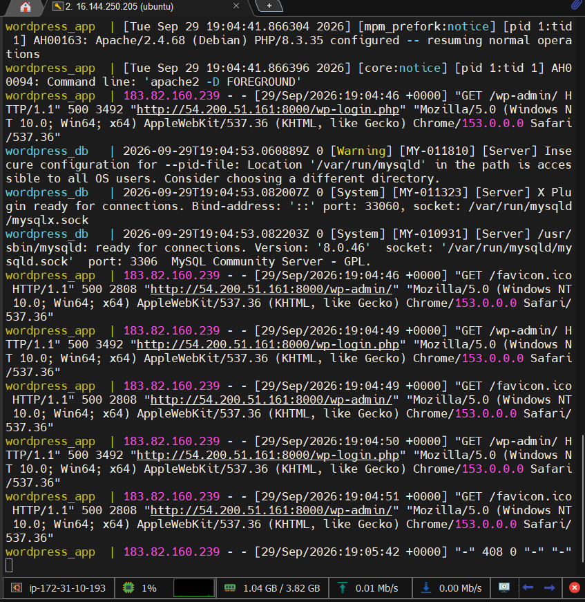
```bash
docker compose logs -f
```

### 4. View logs of a specific service
Filters logs down to a single specified service (e.g., just the database).
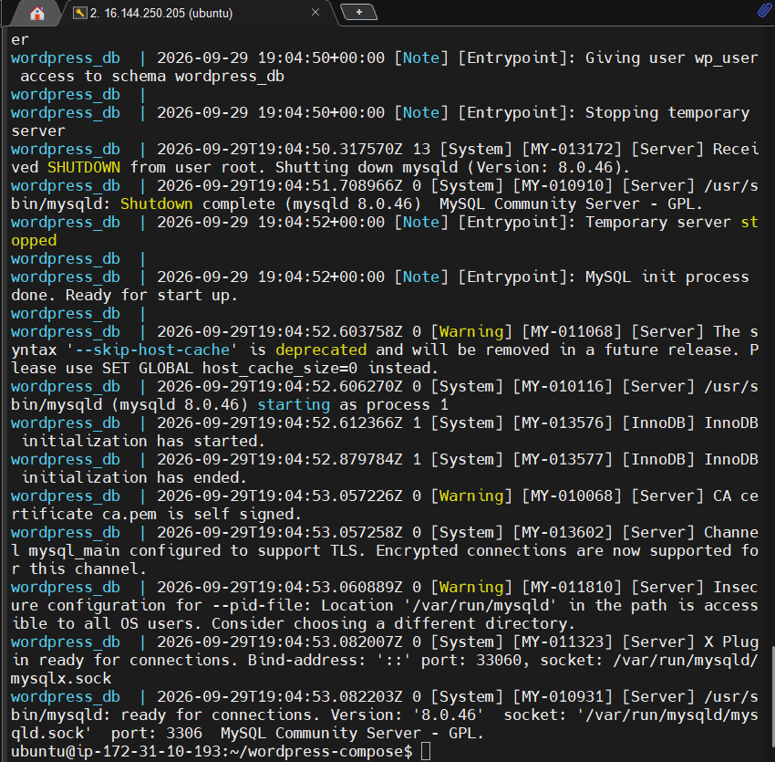

```bash
docker compose logs db
```

### 5. Stop services without removing them
Halts container execution but preserves the containers, networks, and volumes in an inactive state.
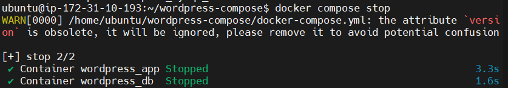

```bash
docker compose stop
```

### 6. Remove everything
Stops and deletes containers, networks, and internal resources created by `up`.
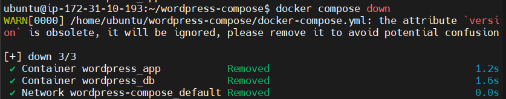

```bash
docker compose down
```
*(Optional: Use `docker compose down -v` to delete the named volumes as well).*

### 7. Rebuild images if you make a change
Forces Docker Compose to recreate images from modified Dockerfiles before running the containers.
```bash

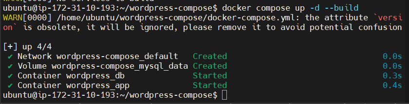

docker compose up --build
```
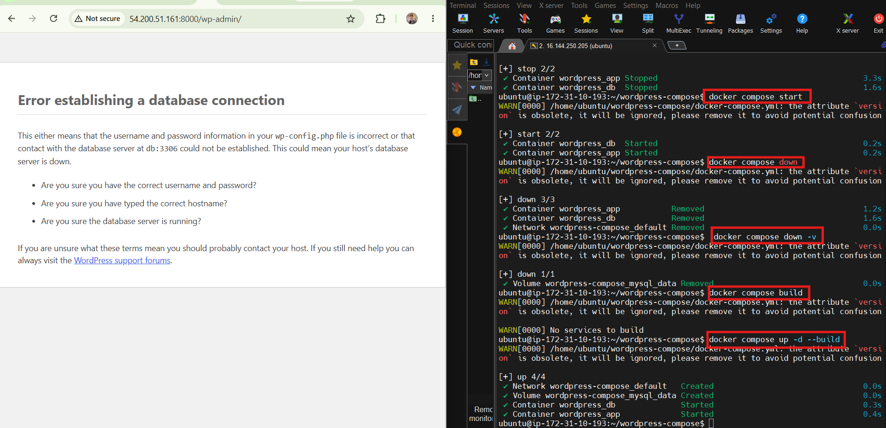

---

## Task 5: Environment Variables
* Environment variables are declared cleanly inside a `.env` file to prevent committing hardcoded credentials to version control.
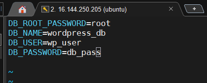

* Values are injected directly into the `docker-compose.yml` configuration at runtime using the `${VARIABLE_NAME}` syntax.
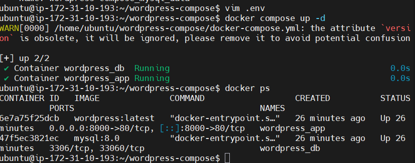

* Verified injection by running `docker compose config` to review the fully compiled YAML file with expanded values.
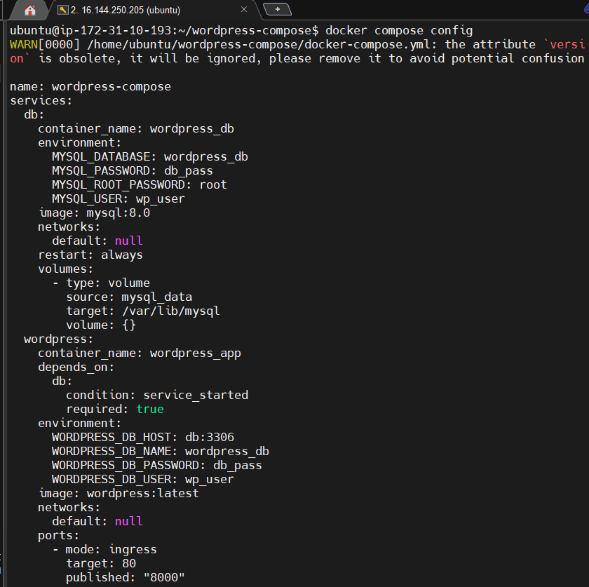
-------------------------------------------------

Key Learnings
Docker Compose

Docker Compose allows multiple containers, networks and volumes to be
defined and managed from a single YAML file.

Service Name DNS

Containers in the same Compose project can communicate using service
names.

Example:

WORDPRESS → db:3306 → MYSQL
Named Volumes

Named volumes provide persistent storage for containers.

docker compose down vs stop

docker compose stop stops containers without removing them.

docker compose down stops and removes containers and the Compose
network.

Environment Variables

Compose supports environment variables directly in the YAML file and
through a .env file.
-------------------------------------------------
**Commands practiced**

# docker compose version
docker compose config
docker compose up
docker compose up -d
docker compose ps
docker compose logs
docker compose logs -f
docker compose logs wordpress
docker compose stop
docker compose start
docker compose down
docker compose down -v
docker compose build
docker compose up -d --build